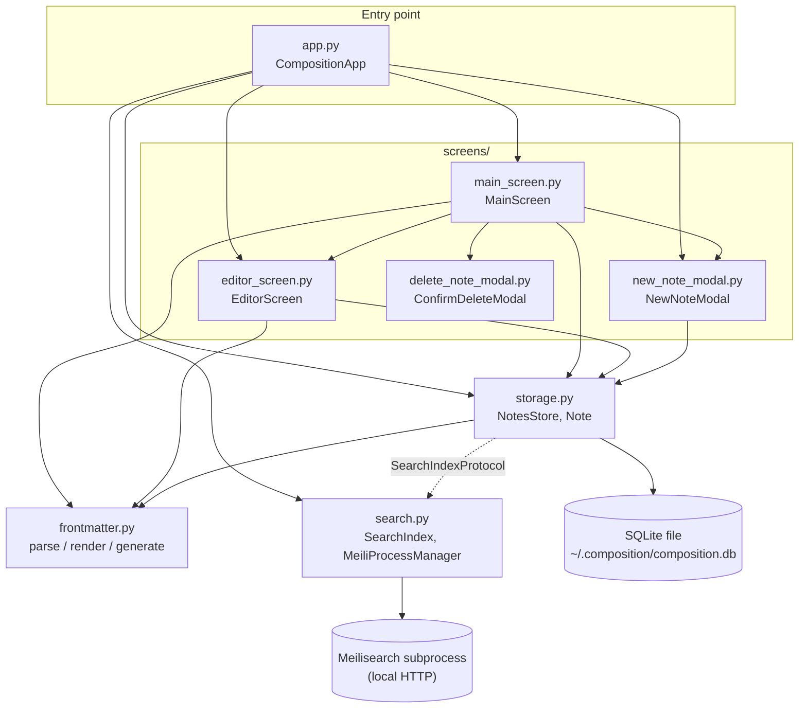

# Architecture

Composition is a local-first, terminal-based Markdown note-taking app. There is no
server and no client/server split: a single process owns the UI, the data, and a
locally-spawned search engine, all running on the user's machine.

- **UI**: [Textual](https://textual.textualize.io/), a Python TUI framework built on an
  async event loop, reactive widgets, and a screen stack (push/pop navigation, similar
  to a mobile app).
- **Persistence**: SQLite, a single file at `~/.composition/composition.db`. This is the
  source of truth for every note.
- **Search**: [Meilisearch](https://www.meilisearch.com/), run as a local subprocess that
  Composition starts, health-checks, and stops itself. It holds a derived, fully
  rebuildable full-text index — SQLite can always regenerate it from scratch.
- **Note format**: each note's content is Markdown text with an optional YAML
  frontmatter block (`title`, `description`, `tags`, `createdAt`, `updatedAt`) at the
  top, parsed/generated by a small pure module. See
  [data-model.md](architecture/data-model.md) for the full shape.

## Tech stack

| Concern | Library | Notes |
|---|---|---|
| TUI framework | `textual[syntax]` | Screens, widgets, reactive/event system, CSS-like styling. The `syntax` extra powers Markdown syntax highlighting in the editor's `TextArea`. |
| Full-text search | `meilisearch` (Python client) | Talks to a locally-spawned `meilisearch` binary over HTTP; not a hosted/remote service. |
| Frontmatter parsing | `pyyaml` | Backs `frontmatter.py`'s YAML block parse/generate. |
| Persistence | `sqlite3` (stdlib) | No ORM; hand-written schema + additive `ALTER TABLE` migrations. |
| Tests | `pytest`, `pytest-asyncio` | `asyncio_mode = "auto"` since Textual apps/tests are async. |

## Component map

`storage.py` depends on `search.py` only through the structural `SearchIndexProtocol` —
it never imports Meilisearch types directly, so storage tests can inject a fake index.

## Repo map

| File | Purpose |
|---|---|
| `src/composition/app.py` | `CompositionApp` (Textual `App` shell): wires storage, search, and the Meilisearch subprocess together; the `main()` CLI entry point. |
| `src/composition/storage.py` | `NotesStore`: SQLite-backed CRUD for notes; the `Note` dataclass; the `SearchIndexProtocol` storage depends on. |
| `src/composition/search.py` | Meilisearch integration: query-string parsing, subprocess lifecycle (`MeiliProcessManager`), and the `SearchIndex` client wrapper. |
| `src/composition/frontmatter.py` | Pure parse/render/generate for the YAML frontmatter block embedded in note content. |
| `src/composition/screens/main_screen.py` | `MainScreen`: notes list + live preview + search bar; the app's home screen. |
| `src/composition/screens/editor_screen.py` | `EditorScreen`: full-screen Markdown editor with debounced autosave. |
| `src/composition/screens/new_note_modal.py` | `NewNoteModal`: title prompt that creates a note. |
| `src/composition/screens/delete_note_modal.py` | `ConfirmDeleteModal`: yes/no confirmation before deleting a note. |

## Process flows

Each of these covers one slice of the system in more depth, with sequence/flow
diagrams tied to specific source lines:

- [Startup & shutdown](architecture/startup.md) — how the app boots the Meilisearch
  subprocess and storage layer, and tears them down on exit.
- [Screen navigation](architecture/screen-navigation.md) — the screen stack, key
  bindings, and transitions between `MainScreen`, `EditorScreen`, and the modals.
- [Note lifecycle](architecture/note-lifecycle.md) — creating a note and the
  debounced autosave/frontmatter-reconciliation flow in the editor.
- [Search](architecture/search.md) — how a search-bar query becomes a filtered
  Meilisearch query, and how the index stays in sync with SQLite.
- [Data model](architecture/data-model.md) — the `Note` and `Frontmatter` shapes,
  the SQLite schema, and the on-disk note content format.
