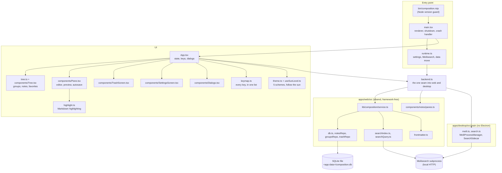

# Architecture

This page is about the terminal app, `apps/cli`. For the other two products see
[product-builds.md](product-builds.md); for what each can do, [feature-matrix.md](feature-matrix.md).

Composition is a local-first, terminal-based Markdown note-taking app. There is no
server and no client/server split: a single process owns the UI, the data, and a
locally-spawned search engine, all running on the user's machine.

- **UI**: [OpenTUI](https://opentui.com) with React. OpenTUI is a TypeScript library on a native
  (Zig) core that draws cells to the terminal; `@opentui/react` lets the UI be written as React
  components. It runs on **Node 26.10 or newer**, because it uses Node's `node:ffi` (on by default
  from 26.10, still marked experimental).
- **Persistence**: SQLite, a single `composition.db` file in the configured application data
  directory (by default `~/.composition`), opened with `better-sqlite3`. This is the source of
  truth for every note.
- **Search**: [Meilisearch](https://www.meilisearch.com/), run as a local subprocess that
  Composition starts, health-checks, and stops itself. It holds a derived, fully rebuildable
  full-text index; SQLite can always regenerate it from scratch.
- **Note format**: each note's content is Markdown text with an optional YAML frontmatter block
  (`title`, `description`, `tags`, `createdAt`, `updatedAt`) at the top. See
  [data-model.md](architecture/data-model.md).
- **Groups**: notes can be organized under nested, folder-like groups, a database-only
  relationship (`notes.group_id` / `groups.parent_id`) with no frontmatter representation. See
  [groups.md](architecture/groups.md).
- **Shared code**: the data layer, the search query parser and index, the frontmatter parser,
  the pane arrangement and the Meilisearch process manager are not written here. They live in
  `apps/web` and `apps/desktop` and are reached through one file, `apps/cli/src/backend.ts`,
  the same way the desktop app reaches the web app's data layer. See
  [Shared code](#shared-code).

## Tech stack

| Concern | Library | Notes |
|---|---|---|
| TUI framework | `@opentui/core`, `@opentui/react` | Pinned to an exact version: it is pre-1.0 and its API still moves. The text editor (`textarea`), Markdown preview (`markdown`), list (`select`), input and scroll box are its built-in widgets. |
| UI language | React 19 | The same major version as the web app, so state logic reads the same way in both. |
| Full-text search | `meilisearch` (JavaScript client, from `apps/web`) | Talks to a locally-spawned `meilisearch` binary over HTTP; not a hosted service. |
| Frontmatter | `js-yaml` | Parse and generate the YAML block. |
| Persistence | `better-sqlite3` 12 | No ORM; hand-written schema and additive `ALTER TABLE` migrations, in `apps/web/src/lib/composition/db.ts`. Version 12 because it runs on both web's Node 22 and the CLI's Node 26. |
| Build | `esbuild` | One ESM bundle per entry point (`scripts/build.mjs`). OpenTUI and `better-sqlite3` stay external. |
| Type-check | TypeScript 7 | `pnpm typecheck`; it also checks the web and desktop files the CLI imports. |
| Tests | `vitest` 5 | Components are rendered headlessly with OpenTUI's test renderer (`@opentui/react/test-utils`) over a real temporary database. |

## Component map

```mermaid
flowchart TB
    subgraph entry["Entry point"]
        bin["bin/composition.mjs<br/>(Node version guard)"]
        main["main.tsx<br/>renderer, shutdown, crash handler"]
        runtime["runtime.ts<br/>settings, Meilisearch, data move"]
    end

    subgraph ui["UI"]
        app["App.tsx<br/>state, keys, dialogs"]
        tree["tree.ts + components/Tree.tsx<br/>groups, notes, favorites"]
        pane["components/Pane.tsx<br/>editor, preview, autosave"]
        trash["components/TrashScreen.tsx"]
        settings["components/SettingsScreen.tsx"]
        dialogs["components/Dialogs.tsx"]
        keymap["keymap.ts<br/>every key, in one list"]
        theme["theme.ts + useSunLevel.ts<br/>5 schemes, follow the sun"]
        hl["highlight.ts<br/>Markdown highlighting"]
    end

    backend["backend.ts<br/>the one seam into web and desktop"]

    subgraph web["apps/web/src (shared, framework-free)"]
        service["lib/composition/service.ts"]
        repos["db.ts, notesRepo, groupsRepo, trashRepo"]
        sidx["searchIndex.ts, searchQuery.ts"]
        fm["frontmatter.ts"]
        panes["components/notes/panes.ts"]
    end

    subgraph desktop["apps/desktop/src/main (no Electron)"]
        meili["meili.ts, search.ts<br/>MeiliProcessManager, SearchSidecar"]
    end

    sqlite[("SQLite file<br/>&lt;app data&gt;/composition.db")]
    meiliproc[("Meilisearch subprocess<br/>(local HTTP)")]

    bin --> main
    main --> runtime
    main --> app
    app --> tree & pane & trash & settings & dialogs
    app --> keymap & theme
    pane --> hl
    app --> backend
    runtime --> backend
    backend --> service & panes & meili
    service --> repos & sidx & fm
    repos --> sqlite
    meili --> meiliproc
    sidx --> meiliproc
```

The UI never opens the database or talks to Meilisearch itself. It calls the `Api` (a subset of
the web app's `service`, see [`api.ts`](../apps/cli/src/api.ts)), which tests can replace one
method at a time.

## Repo map

| File | Purpose |
|---|---|
| [`bin/composition.mjs`](../apps/cli/bin/composition.mjs) | The launcher: checks the Node version, prints `--version`, silences Node's FFI warning, loads the bundle. |
| [`src/main.tsx`](../apps/cli/src/main.tsx) | Starts the runtime, creates the OpenTUI renderer, renders `App`, and shuts everything down (including after a crash, so the terminal is never left in raw mode). |
| [`src/runtime.ts`](../apps/cli/src/runtime.ts) | Settings file and one-time import of the old one, Meilisearch start/stop, and moving the data location. |
| [`src/dataLocation.ts`](../apps/cli/src/dataLocation.ts) | Moves every file of application data to a new folder, with rollback. |
| [`src/legacySettings.ts`](../apps/cli/src/legacySettings.ts) | Imports `~/.composition/settings.yaml` from the Python CLI that preceded this app. |
| [`src/backend.ts`](../apps/cli/src/backend.ts) | The seam: everything imported from `apps/web` and `apps/desktop`. |
| [`src/api.ts`](../apps/cli/src/api.ts) | The part of the data layer the UI uses, as a type, so tests can swap methods. |
| [`src/App.tsx`](../apps/cli/src/App.tsx) | The workspace: the tree, the panes, search, dialogs, and what each key does. |
| [`src/tree.ts`](../apps/cli/src/tree.ts) | Turns notes, groups, favorites and a search into the tree's rows. Pure. |
| [`src/keymap.ts`](../apps/cli/src/keymap.ts) | Every binding, driving the handlers, the footer and the `?` overlay. See [cli-keybindings.md](ui/cli-keybindings.md). |
| [`src/highlight.ts`](../apps/cli/src/highlight.ts) | Markdown highlighting for the editor, which OpenTUI's textarea does not do itself. Pure. |
| [`src/mdx.ts`](../apps/cli/src/mdx.ts) | Turns a note's body into what the preview draws: stretches of Markdown, `<Info>`/`<Warning>` panels, a `<Toc>`, images. Parses with the web's MDX plugins. Pure. See [mdx-components.md](ui/mdx-components.md). |
| [`src/images.ts`](../apps/cli/src/images.ts) | Reads and decodes a stored image (shrunk, cached), and works out how many cells to draw it in. See [images.md](architecture/images.md#in-the-cli). |
| [`src/theme.ts`](../apps/cli/src/theme.ts), [`src/useSunLevel.ts`](../apps/cli/src/useSunLevel.ts) | The five color schemes and the "follow the sun" blend. |
| [`src/components/`](../apps/cli/src/components) | `Tree`, `Pane` (editor, preview, autosave), `Preview` and `PreviewImage` (the Markdown, MDX and image drawing), `TrashScreen`, `SettingsScreen` and the dialogs. |
| [`src/tools/`](../apps/cli/src/tools) | `pnpm seed` and `pnpm search:playground`: dummy notes and a search REPL, both in scratch folders. |
| [`scripts/build.mjs`](../apps/cli/scripts/build.mjs), [`scripts/dev.mjs`](../apps/cli/scripts/dev.mjs) | The esbuild bundle, and build-then-run with an optional scratch home. |

## Shared code

The CLI imports, through [`backend.ts`](../apps/cli/src/backend.ts):

- from `apps/web/src/lib/composition`: `service`, `searchIndex`, the settings, `frontmatter`,
  `favorites`, `themes`, the pure group-move and sun-schedule helpers;
- from `apps/web/src/components/notes`: `panes.ts`, the arrangement of side-by-side panes (pure
  state, no React), and `mdx/remarkRestrictMdx.ts` and `mdx/remarkHeadings.ts`, the plugins that
  decide which MDX a note may use and collect its headings (pure functions over the syntax tree);
- from `apps/desktop/src/main`: `MeiliProcessManager`, `SearchSidecar` and `resolveMeiliBinary`
  (Node built-ins only, no Electron).

This is a deliberate stop-gap. Three products sharing one data layer through relative imports
works, but it means the CLI needs `apps/web`'s dependencies installed to build, and two small
workarounds (`better-sqlite3` is resolved from the CLI's own copy, in the bundle and in the tests).
[shared-core-plan.md](shared-core-plan.md) lays out the steps to move all of this into one package
the three apps depend on.

## Process flows

Each of these covers one slice of the system in more depth:

- [Startup & shutdown](architecture/startup.md): how the app starts Meilisearch and opens the
  database, and tears them down on exit.
- [Screen navigation](architecture/screen-navigation.md): the workspace, its focus areas, panes
  and the screens and dialogs on top of it.
- [Note lifecycle](architecture/note-lifecycle.md): creating a note and the debounced
  autosave and frontmatter reconciliation.
- [Search](architecture/search.md): how a search-bar query becomes a filtered Meilisearch query,
  and how the index stays in sync with SQLite.
- [Data model](architecture/data-model.md): the `Note` and `Frontmatter` shapes, the SQLite
  schema, and the on-disk note format.
- [Groups](architecture/groups.md): the group and note relationship, nesting, the blocked-delete
  rule, favorites, and how the tree is built.
- [Images](architecture/images.md): pasting images into a note in the web and desktop apps, and how
  the terminal app draws them.
- [Attachments](architecture/attachments.md): files attached to a note (desktop only).
