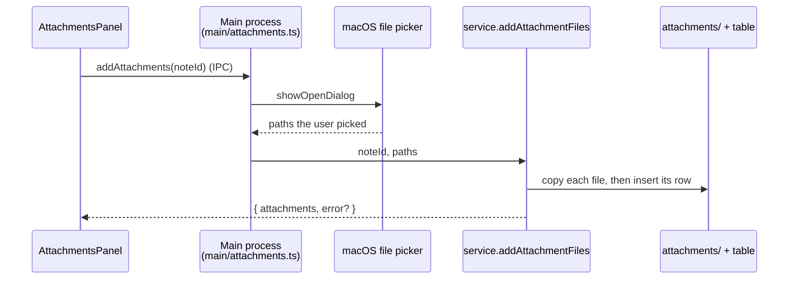

# Attachments

Source: [`attachmentsApi.ts`](../../apps/web/src/lib/composition/attachmentsApi.ts),
[`attachments.ts`](../../apps/web/src/lib/composition/attachments.ts),
[`attachmentsRepo.ts`](../../apps/web/src/lib/composition/attachmentsRepo.ts),
[`AttachmentsPanel.tsx`](../../apps/web/src/components/notes/AttachmentsPanel.tsx),
[`main/attachments.ts`](../../apps/desktop/src/main/attachments.ts)

Any type of file can be attached to a note in the **desktop app**. The web app and the
CLI do not offer it (see the [feature matrix](../feature-matrix.md)).

An attachment is not part of the note's text. Unlike an [image](images.md), nothing in
the Markdown refers to it: the note's attachments are a list kept beside it, shown in a
table at the bottom of the note.

## What the user sees

At the bottom of each open note there is an **Attachments** bar with an **Attach files**
button. With nothing attached, that is all there is. Once the note has attachments, a table
appears under the bar:

| Name | Size | Added | |
|---|---|---|---|
| Quarterly report.pdf | 1.4 MB | Oct 1, 2026 | show in Finder · save a copy · remove |

- **Attach files** opens the macOS file picker. Several files can be chosen at once.
- **Show in Finder** reveals the stored copy.
- **Save a copy…** asks where to write one.
- **Remove** asks a second time ("Remove report.pdf?"), because it deletes the stored
  file for good.

A file that can't be attached (a folder, one over 100 MB, one that can't be read) is named
in a message above the table; the other files chosen with it are still attached.

## Where things live

```
~/.composition/
├── composition.db              attachments table: one row per attachment
└── attachments/
    └── 3f9c2a71b0de-Quarterly_report.pdf
```

```sql
CREATE TABLE attachments (
    id INTEGER PRIMARY KEY AUTOINCREMENT,
    note_id INTEGER NOT NULL,
    file_name TEXT NOT NULL,     -- the name the user attached it as, shown in the table
    stored_name TEXT NOT NULL,   -- the file's name in attachments/
    size INTEGER NOT NULL,       -- bytes
    created_at TEXT NOT NULL
);
```

The bytes are a plain file, copied at attach time (the original is left alone). The
stored name is `<12 random hex digits>-<original name made safe>`: anything outside
`A-Za-z0-9_-` becomes `_`, and the extension is kept so Finder still knows the file type.
Two attachments with the same name never collide, and no name can contain a path.

The table is created by `db.ts`, which the CLI, web and desktop apps all open the file through
([product-builds.md](../product-builds.md#what-sharing-costs-right-now) says why the schema now
lives in one place).

## How it works

The desktop-only methods are a **separate contract**, `AttachmentsApi`, not part of
`CompositionApi`. The web app implements every method of `CompositionApi` as a Server
Action; since attachments are not in it, the web app has no endpoint for them at all.



The renderer sends only an id. **It never supplies a path**, and file bytes never cross
the bridge. So a compromised page can't make the app read `~/.ssh/id_rsa` into a note, or
overwrite a file of its choosing: the paths come from a dialog the user is looking at, and
the stored file is found from the row, never from anything the page sent.

Reaching the table in the build takes three build-time swaps (the same mechanism as
`navLinks.desktop.ts`; see [next.config.ts](../../apps/web/next.config.ts)):

| Web build | Desktop build |
|---|---|
| `AttachmentsSlot.tsx`: renders nothing, so the panel is not in the web bundle | `AttachmentsSlot.desktop.tsx`: the panel |
| `attachmentsClient.ts`: throws "only available in the desktop app" | `attachmentsClient.desktop.ts`: calls `window.composition` |

## Deleting

- **Remove** in the table deletes the row and its stored file.
- **Moving a note to the Trash Can** ([web-trash-can.md](../ui/web-trash-can.md)) keeps its
  attachments. A restored note keeps its id, so its attachment rows find it again.
- **Permanently deleting a note**, by hand or because it outlived the Trash Can's 60 days,
  deletes its attachments: rows and stored files. The service removes any attachment whose
  note is in neither `notes` nor `trashed_notes` (`removeOrphans` in
  [`attachments.ts`](../../apps/web/src/lib/composition/attachments.ts)).
- **Deleting a note in the CLI**, which has no Trash Can and deletes for good, removes its
  attachment rows and files at once (`NotesStore.delete_note`).

A file that is already gone is never an error.

## Decisions

- **No "open".** Opening an attachment in its default app would run an attached `.command`
  script or `.app`, and a note's database can come from someone else. Showing it in Finder
  or saving a copy leaves that choice to the user.
- **100 MB per file.** The bytes are on disk, not in the database, so this is a sanity
  limit. It is `MAX_ATTACHMENT_BYTES` in
  [`attachmentNames.ts`](../../apps/web/src/lib/composition/attachmentNames.ts).
- **Not in the note's frontmatter.** The CLI rewrites frontmatter from the keys it knows,
  so an unknown key would be dropped the first time a note was edited there.

## Backups

**Settings → Backup** includes every attached file (and the `attachments` table, which is in the
database), and **Restore** brings them back; see [backup-restore.md](backup-restore.md).

## Gaps

- Attachment names and contents are not searched.
- Files are added only with the button: no drag-and-drop from Finder, and no rename.
- Changing **Application data location** points the apps at a new directory without moving
  anything. Copy `attachments/` along with `composition.db`, as with `app_data/`.
- `attachments/` is found beside the application data directory (the CLI: beside the
  database file), so a database path overridden into a different folder from it splits them.
- The web app shows nothing for a note's attachments, even when it opens a database the
  desktop app has attached files to.
