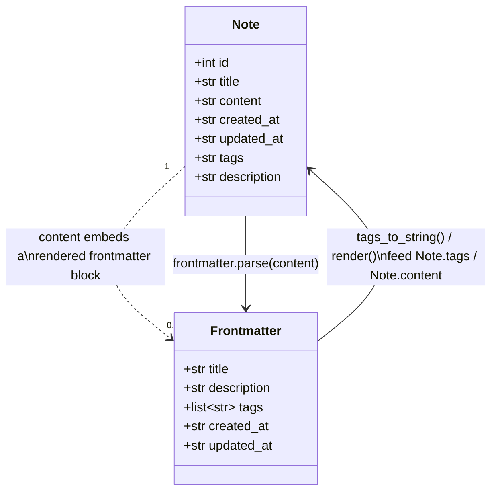

# Data model

Source: [`storage.py`](../../src/composition/storage.py),
[`frontmatter.py`](../../src/composition/frontmatter.py)

## Storage location

Notes are **not** stored as individual files on disk. Everything lives in one SQLite
database file:

```
~/.composition/composition.db
```

A note's Markdown content — including its embedded YAML frontmatter — is a single
`TEXT` column in that database. Search's Meilisearch data directory
(`~/.composition/meili_data/`) and its log/master-key files live alongside it, but
they're a derived index, not a second copy of the notes.

## Schema

```sql
CREATE TABLE notes (
    id INTEGER PRIMARY KEY AUTOINCREMENT,
    title TEXT NOT NULL,
    content TEXT NOT NULL DEFAULT '',
    tags TEXT NOT NULL DEFAULT '',
    description TEXT NOT NULL DEFAULT '',
    created_at TEXT NOT NULL,
    updated_at TEXT NOT NULL,
    group_id INTEGER
);

CREATE TABLE groups (
    id INTEGER PRIMARY KEY AUTOINCREMENT,
    name TEXT NOT NULL,
    parent_id INTEGER,
    created_at TEXT NOT NULL,
    updated_at TEXT NOT NULL
);
```

`tags`, `description`, and `group_id` were all added after the `notes` table's original
creation. Rather than a migration-file system, `NotesStore.__init__` runs
`_ensure_tags_column`, `_ensure_description_column`, and `_ensure_group_id_column` on
every startup, each checking `PRAGMA table_info(notes)` and issuing an additive
`ALTER TABLE ... ADD COLUMN` only if the column is missing — safe to run against both a
brand-new and a pre-existing database. `groups` itself is a `CREATE TABLE IF NOT EXISTS`
run alongside the `notes` schema, for the same reason.

See [groups.md](groups.md) for how `notes.group_id` and `groups.parent_id` relate to
each other and how they're rendered as a tree.

## Two representations of the same metadata



- **`storage.Note`** is the row-shaped, persisted model. `tags` is a flat
  comma-joined string (matching the SQLite column) and `content` is the full raw text
  the editor's `TextArea` shows, frontmatter block included.
- **`frontmatter.Frontmatter`** is a transient, in-memory representation used only
  while parsing or rendering: `tags` is a real `list[str]`, and there's no `id` — it's
  never persisted on its own, only serialized into `Note.content`.
- `frontmatter.tags_to_string` / `tags_from_string` are the two converters that keep
  the flat-string and list representations in sync.

Unlike `tags`/`description`/`title`, `group_id` has **no** frontmatter representation —
group membership is database-only and never round-trips through the YAML block. See
[groups.md](groups.md) for why.

## On-disk note content format

```
---
title: Grocery List
description: ''
tags:
- kitchen
- errands
createdAt: '2026-09-01T12:00:00+00:00'
updatedAt: '2026-09-14T08:30:00+00:00'
---
- [ ] Milk
- [ ] Eggs
```

Frontmatter keys are camelCase (`createdAt`, `updatedAt`) in the YAML text, matching
Markdown-frontmatter convention, even though the Python side uses snake_case
(`created_at`, `updated_at`) — `frontmatter._serialize`/`parse` are the only places
that translate between the two. Key order is fixed
(`title`, `description`, `tags`, `createdAt`, `updatedAt`) and pinned by
[`tests/test_frontmatter.py`](../../tests/test_frontmatter.py).

`frontmatter.parse` is designed to never raise: a note with no leading `---` block, a
non-mapping YAML document, or invalid YAML simply parses to `(None, original_content)`.
This is what lets [the autosave flow](note-lifecycle.md) fall back to a raw content
save instead of crashing whenever the user is mid-edit of the metadata block.
`frontmatter.strip(content)` uses the same parser to drop the block entirely, which is
how `MainScreen`'s preview pane shows a clean note body without the YAML.
