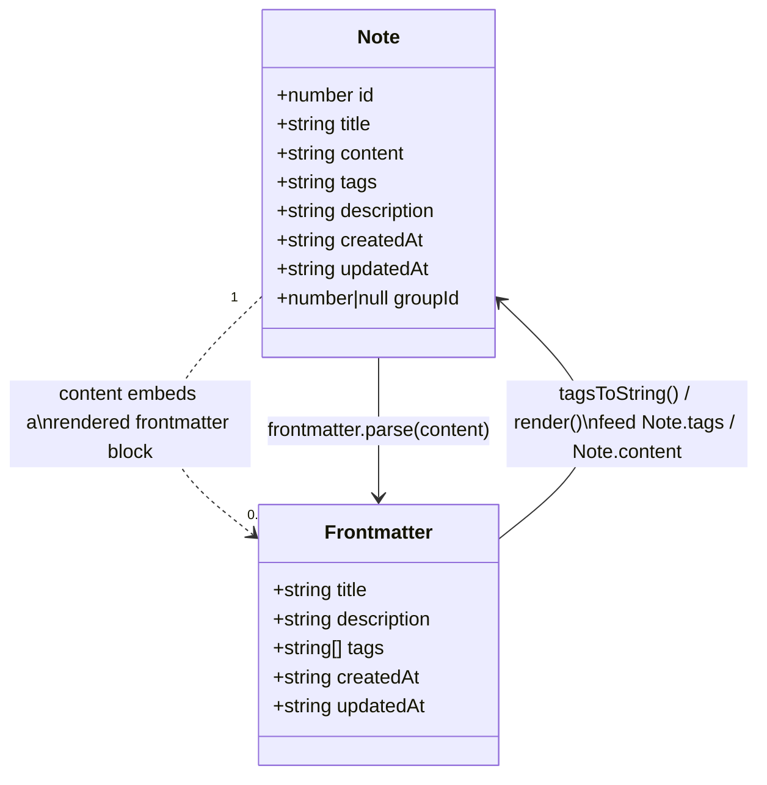

# Data model

Source: [`db.ts`](../../apps/web/src/lib/composition/db.ts),
[`notesRepo.ts`](../../apps/web/src/lib/composition/notesRepo.ts),
[`frontmatter.ts`](../../apps/web/src/lib/composition/frontmatter.ts),
[`webSettings.ts`](../../apps/web/src/lib/composition/webSettings.ts),
[`dataLocation.ts`](../../apps/cli/src/dataLocation.ts)

The terminal, web and desktop apps all open the same database through this one shared data
layer, so nothing here is specific to the terminal app. (The Python CLI that preceded it had its
own copy of the schema code; that is gone, and so is the old rule that schema changes had to
land in two languages.)

## Storage location

Notes are **not** stored as individual files on disk. Everything lives in one SQLite database
file inside the configured application data directory:

```
<application data>/composition.db
```

A note's Markdown content, including its embedded YAML frontmatter, is a single `TEXT` column in
that database. Images pasted into a note in the web and desktop apps are the exception: they are
files in an `app_data/` folder beside the database, and the note's Markdown refers to them by path
(see [images.md](images.md)). Files attached to a note in the desktop app are files in an
`attachments/` folder, described by rows of an `attachments` table (see
[attachments.md](attachments.md)). The Meilisearch data directory (`meili_data/`) and its
log and master-key files live alongside it. The search index is derived data, not a second source of
truth for the notes.

The directory defaults to `~/.composition`.

### Settings

The terminal app's settings are its own file, `~/.composition-cli/settings.json`, in the web app's
settings format: the data directory, the color scheme, the city for "follow the sun", the pinned
favorites, and the column layout (stored but not used by the terminal). It sits **outside** the data
directory on purpose, so it can say where the data directory is, and survives that directory
moving. The web and desktop apps keep theirs in their own places (see
[product-builds.md](../product-builds.md)); a setting changed in one does not change in the others.

A copy of the file is read once from `~/.composition/settings.yaml` the first time, if the Python CLI
left one there (see [startup.md](startup.md)).

### Moving the data

Changing **Application data location** in Settings stops Meilisearch, closes SQLite, moves every
managed artifact to the new folder, saves the new location, and reopens everything there. What moves:

| What | Where |
|---|---|
| The database and its `-wal`, `-shm` and `-journal` files | `composition.db` |
| The search index, its log and its master key | `meili_data/`, `meili.log`, `meili_master_key` |
| Pasted images | `app_data/` |
| Attached files | `attachments/` |

(The folder names come from the web app's own constants, and a test pins them, because a pasted
image left behind is a broken link in every note that uses it.) If the destination already holds any
of these, nothing is moved; a destination inside the current folder, or a file, is refused; and if
anything fails halfway, whatever was moved is moved back and the old location keeps working. Web and
desktop only repoint to the new folder, they do not move files; the terminal app has always moved
them for you, and kept that.

## Schema

```sql
CREATE TABLE notes (
    id INTEGER PRIMARY KEY AUTOINCREMENT,
    title TEXT NOT NULL,
    content TEXT NOT NULL DEFAULT '',
    tags TEXT NOT NULL DEFAULT '',
    description TEXT NOT NULL DEFAULT '',
    created_at TEXT NOT NULL,
    updated_at TEXT NOT NULL,
    group_id INTEGER
);

CREATE TABLE groups (
    id INTEGER PRIMARY KEY AUTOINCREMENT,
    name TEXT NOT NULL,
    parent_id INTEGER,
    created_at TEXT NOT NULL,
    updated_at TEXT NOT NULL
);
```

`tags`, `description`, and `group_id` were all added after the `notes` table's original creation.
Rather than a migration-file system, `db.ts` runs three `ensureColumn` checks every time it opens
the file, each looking at `PRAGMA table_info(notes)` and issuing an additive `ALTER TABLE … ADD
COLUMN` only if the column is missing: safe against both a brand-new and a pre-existing database.
Every other table is a `CREATE TABLE IF NOT EXISTS`, for the same reason. `db.test.ts` opens
databases as each earlier version created them and checks every column arrives with the data
intact.

Write-ahead logging is switched on when the file is opened. It is stored in the file itself, so it
covers every app that opens it, and lets the terminal, web and desktop apps run side by side on one
database.

Three more groups of tables belong to features the older apps never had:

```sql
-- the Trash Can: the same columns as notes and groups, plus when it was deleted
CREATE TABLE trashed_notes  (id INTEGER PRIMARY KEY, title TEXT NOT NULL, content TEXT NOT NULL DEFAULT '', tags TEXT NOT NULL DEFAULT '', description TEXT NOT NULL DEFAULT '', created_at TEXT NOT NULL, updated_at TEXT NOT NULL, group_id INTEGER, deleted_at TEXT NOT NULL);
CREATE TABLE trashed_groups (id INTEGER PRIMARY KEY, name TEXT NOT NULL, parent_id INTEGER, created_at TEXT NOT NULL, updated_at TEXT NOT NULL, deleted_at TEXT NOT NULL);

-- files attached to a note (desktop only)
CREATE TABLE attachments (
    id INTEGER PRIMARY KEY AUTOINCREMENT,
    note_id INTEGER NOT NULL,
    file_name TEXT NOT NULL,
    stored_name TEXT NOT NULL,
    size INTEGER NOT NULL,
    created_at TEXT NOT NULL
);
```

`trashed_notes` and `trashed_groups` hold what was deleted, keeping the original ids, until it is
restored or permanently deleted after 60 days (see [web-trash-can.md](../ui/web-trash-can.md)). They
are separate tables rather than a flag on `notes` and `groups` so that an app that has not heard of
the Trash Can never lists a deleted note. The terminal app now has the Trash Can too, like web and
desktop. It still never shows or adds **attachments**, but it leaves them alone: a note in the Trash
Can keeps its attachments until it is permanently deleted.

Favorites are not in the database. They are a list in the settings file, so a new column could not
break an app that builds its models straight from `SELECT *` (see [groups.md](groups.md)).

See [groups.md](groups.md) for how `notes.group_id` and `groups.parent_id` relate to each other
and how they are shown as a tree.

## Two representations of the same metadata


```mermaid
classDiagram
    class Note {
        +number id
        +string title
        +string content
        +string tags
        +string description
        +string createdAt
        +string updatedAt
        +number|null groupId
    }
    class Frontmatter {
        +string title
        +string description
        +string[] tags
        +string createdAt
        +string updatedAt
    }
    Note "1" ..> "0..1" Frontmatter : content embeds a\nrendered frontmatter block
    Frontmatter --> Note : tagsToString() / render()\nfeed Note.tags / Note.content
    Note --> Frontmatter : frontmatter.parse(content)
```

- **`Note`** is the row-shaped, persisted model (`notesRepo.ts`). `tags` is a flat comma-joined
  string, matching the SQLite column, and `content` is the full raw text the editor shows,
  frontmatter block included.
- **`Frontmatter`** is a transient, in-memory representation used only while parsing or rendering:
  `tags` is a real `string[]`, and there is no `id`. It is never persisted on its own, only
  serialized into `Note.content`.
- `frontmatter.tagsToString` and `tagsFromString` are the two converters that keep the flat string
  and the list in sync.

Unlike `tags`, `description` and `title`, `groupId` has **no** frontmatter representation: group
membership is database-only and never round-trips through the YAML block. See
[groups.md](groups.md) for why.

## On-disk note content format

```
---
title: Grocery List
description: ''
tags:
- kitchen
- errands
createdAt: '2026-09-01T12:00:00+00:00'
updatedAt: '2026-09-14T08:30:00+00:00'
---
- [ ] Milk
- [ ] Eggs
```

Frontmatter keys are camelCase (`createdAt`, `updatedAt`) in the YAML text, matching
Markdown-frontmatter convention; the database columns are snake_case (`created_at`, `updated_at`),
and `frontmatter.ts` and the repos are the only places that translate between the two. Key order is
fixed (`title`, `description`, `tags`, `createdAt`, `updatedAt`), and the exact format, including
the unindented list of tags, is pinned by `frontmatter.test.ts`, because every note already stored
was written in it and must stay readable.

`frontmatter.parse` is designed to never throw: a note with no leading `---` block, a non-mapping
YAML document, or invalid YAML simply parses to `[null, original content]`. This is what lets
[the autosave flow](note-lifecycle.md) fall back to a raw content save instead of failing whenever
the user is mid-edit of the metadata block. The preview uses the same parser to drop the block, so
it shows a clean note body without the YAML.
