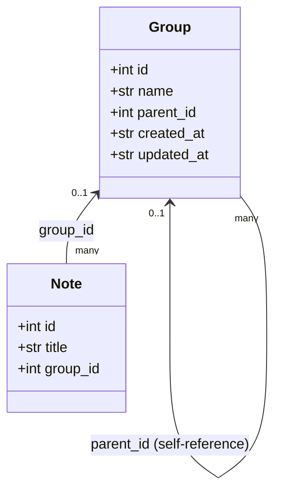

# Groups

Source: [`storage.py`](../../src/composition/storage.py),
[`screens/main_screen.py`](../../src/composition/screens/main_screen.py),
[`screens/new_group_modal.py`](../../src/composition/screens/new_group_modal.py),
[`screens/select_group_modal.py`](../../src/composition/screens/select_group_modal.py)

Groups let a note be organized under a folder-like name in the UI. A note belongs to
at most one group; groups themselves can nest.

## Relationship

- `groups.parent_id` is `NULL` for a top-level group, or another group's `id` for a
  sub-group. Nesting is unbounded.
- `notes.group_id` is `NULL` for an ungrouped note.
- This is **one group per note**, not tag-style many-to-many — a note lives under
  exactly one place in the tree, matching how the UI presents it (top-level group
  names, notes nested underneath).
- Group membership is **database-only**. Unlike `title`/`tags`/`description`, it is
  never written into or read from a note's YAML frontmatter block — see
  [data-model.md](data-model.md).
- There's no DB-level `FOREIGN KEY` constraint (the codebase never turns on
  `PRAGMA foreign_keys`); referential integrity is enforced at the `NotesStore` layer
  instead, consistent with the rest of its hand-rolled style.

## Deleting a group

`NotesStore.delete_group` refuses to delete a group that still has sub-groups or notes
directly in it, raising `GroupNotEmptyError`. There is no cascade and no
auto-promotion of children to a parent — the group must be emptied first.
`NotesStore.group_is_empty` is the read-only check `MainScreen` uses to decide whether
to show a warning notification instead of the delete-confirmation modal.

## Rendering as a tree

`MainScreen` renders a Textual `Tree` (`#notes-tree`) instead of a flat list, since
groups nest arbitrarily. `_populate_tree` in
[`main_screen.py`](../../src/composition/screens/main_screen.py):

1. Loads the full group hierarchy via `store.list_groups()` and buckets it by
   `parent_id`, so the entire group structure — including empty groups — is always
   visible and navigable (e.g. right after creating a new one).
2. Buckets the given `notes` list by `group_id` and attaches each note as a leaf under
   its group's node, or under a synthetic "Ungrouped" node (`data={"type": "group",
   "id": None}`) for notes with no group.
3. Tags every node's `data` with `{"type": "group" | "note", "id": ...}` so the
   highlight/select/delete handlers can branch on it.

The same function serves both browse mode (`notes = store.list_notes()`) and search
mode (`notes` = the filtered/matched notes) — search only changes which notes appear
as leaves; the group scaffolding stays stable either way, avoiding a separate
tree-vs-list mode switch.

Every group node is expanded on each rebuild (`expand=True`); collapsed state isn't
persisted across a refresh (a search, a create, a delete), keeping the implementation
simple at the cost of losing manual collapses on the next rebuild.

## Key bindings

| Key | Action |
|---|---|
| `ctrl+g` | New group (`NewGroupModal`), nested under the highlighted group if any |
| `m` | Move the highlighted note to a different group (`SelectGroupModal`) |
| `ctrl+d` | Delete the highlighted note or (if empty) group |

See [screen-navigation.md](screen-navigation.md) for the full key-binding table.

## Follow-ups (not implemented)

- **Reparenting an existing group** to a different parent. Doing this safely needs
  cycle prevention (a group can't become its own descendant), which the current
  create-only flow doesn't need to worry about.
- **A `group:` search-bar filter token**, mirroring `tag:`. Today, group membership is
  already reflected correctly in the tree during a search (a note only appears under
  its real group), but there's no dedicated syntax to filter the search itself down to
  one group's contents.
