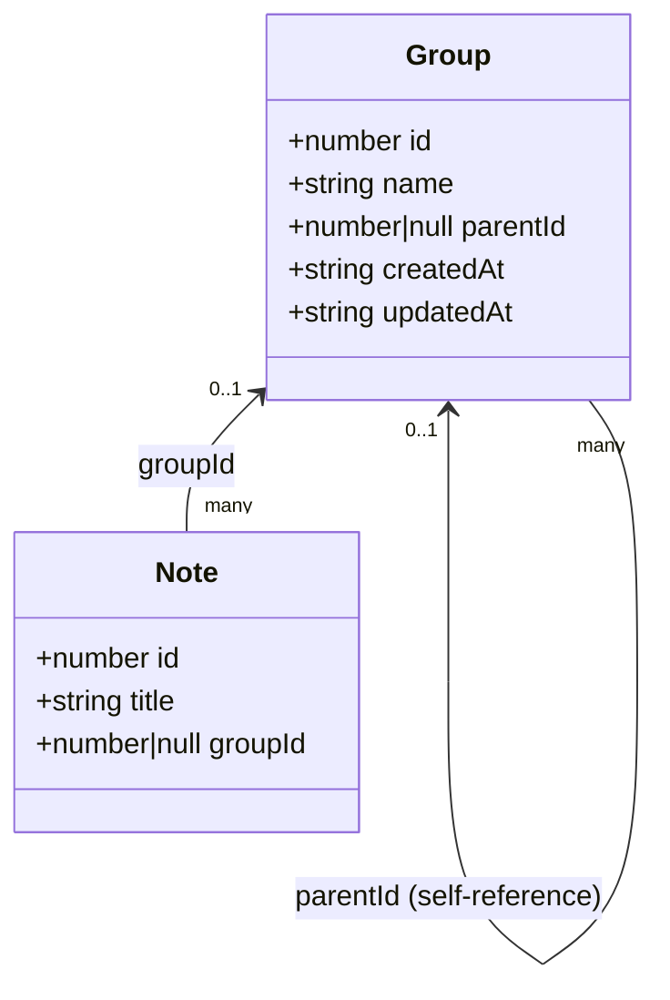

# Groups

Source: [`groupsRepo.ts`](../../apps/web/src/lib/composition/groupsRepo.ts),
[`groupMove.ts`](../../apps/web/src/lib/composition/groupMove.ts),
[`favorites.ts`](../../apps/web/src/lib/composition/favorites.ts),
[`tree.ts`](../../apps/cli/src/tree.ts),
[`App.tsx`](../../apps/cli/src/App.tsx)

Groups let a note be organized under a folder-like name in the UI. A note belongs to at most one
group; groups themselves can nest.

## Relationship

```mermaid
classDiagram
    class Group {
        +number id
        +string name
        +number|null parentId
        +string createdAt
        +string updatedAt
    }
    class Note {
        +number id
        +string title
        +number|null groupId
    }
    Group "0..1" <-- "many" Group : parentId (self-reference)
    Group "0..1" <-- "many" Note : groupId
```

- `groups.parent_id` is `NULL` for a top-level group, or another group's `id` for a sub-group.
  Nesting is unbounded.
- `notes.group_id` is `NULL` for an ungrouped note.
- This is **one group per note**, not tag-style many-to-many: a note lives under exactly one place in
  the tree, matching how the UI presents it (top-level group names, notes nested underneath).
- Group membership is **database-only**. Unlike `title`, `tags` and `description`, it is never
  written into or read from a note's YAML frontmatter block (see [data-model.md](data-model.md)).
- There is no database-level `FOREIGN KEY` constraint (the data layer never turns on
  `PRAGMA foreign_keys`); referential integrity is enforced in the repos instead.

## Deleting a group

A group that still has sub-groups or notes directly in it **cannot be deleted**: the repo refuses
with `GroupNotEmptyError`, and `service.deleteGroup` turns that into a message for the UI. There is
no cascade and no auto-promotion of children to a parent; the group must be emptied first. A group
that is deleted goes to the Trash Can rather than being erased (see
[web-trash-can.md](../ui/web-trash-can.md)), and comes back under its old parent, or at the top
level if that parent has gone.

The terminal app checks for emptiness before it asks, so for a non-empty group it shows
`"Work" still has sub-groups or notes in it. Empty it before deleting.` in the footer instead of a
confirmation. The service's own refusal is still there for the case where another window put a note
in the group a moment earlier.

## Moving a group

`m` on a group offers the top level and every group **except the group itself and everything beneath
it** (a group cannot become its own descendant). The rule is `canMoveGroup` and `wouldCreateCycle` in
`groupMove.ts`, shared with the web app's drag and drop, and the service refuses an invalid move
too. If there is nowhere to move it (a lone top-level group), the footer says so instead of opening an
empty list. `m` on a note offers "Ungrouped" and every group.

## Rendering as a tree

The tree is built by `buildTree` in [`tree.ts`](../../apps/cli/src/tree.ts), a pure function from the
notes, the groups, which groups are folded, the favorites, and whether a search is filtering, to a
flat list of rows. The terminal list widget just draws the rows. It:

1. Buckets the groups by `parentId` and sorts siblings by name, so the whole group structure,
   including empty groups, is always visible and navigable (for instance right after creating one).
2. Buckets the notes by `groupId` and lists each group's sub-groups first and then its own notes,
   most recently edited first.
3. Puts notes with no group under a synthetic **Ungrouped** bucket (`groupId: null`), shown when it
   has notes or when there are no groups at all. Like the Trash and Settings rows below it, it is not
   a real group: rename, delete and move do nothing there.
4. Ends with the **Trash** and **Settings** rows.
5. Gives every row a stable key, so the cursor stays on the same row when the tree is rebuilt.

The same function serves browsing (all notes) and searching (only the notes that matched). While a
search is filtering, groups with no matching note anywhere below them are left out, and with no match
at all the tree says `No notes match.` instead of showing empty groups.

Groups start unfolded; `←` and `→` fold and unfold the highlighted one, and Enter toggles it. Which
groups are folded is kept for the run, not saved.

## Favorites

Pin a group or a note with `f` and it is listed in a **★ Favorites** section above the tree, in the
order it was pinned, and starred (`★`) where it also sits in the tree. Pinning is a shortcut, not a
move: the item stays where it is. The section is hidden while nothing is pinned, and while a search
is filtering the tree.

- A pinned **note** opens like any note (Enter, or `o` to open it beside).
- A pinned **group** (`◆ Name`) is a shortcut: Enter jumps the cursor to the group's own place in the
  tree, unfolding whatever hides it. It cannot be folded itself.
- Everything else works on the underlying note or group: `m`, `r`, `ctrl+d`.
- Unpinning from inside the section leaves the cursor on the item's own row.
- A pinned item that no longer exists is skipped when drawing, and deleting a pinned note or group
  removes its entry.

The pinned list (`{ type: "group" | "note", id }[]`) lives in the settings file, not in the
database: an extra column would break any app that builds its models straight from `SELECT *`. The
trade-off is that pins belong to the settings file, so pointing an app at a different database keeps
the same list. The web and desktop apps have the same feature, with a menu instead of a key.

## Key bindings

| Key | Action |
|---|---|
| `ctrl+g` | New group, inside the highlighted group if any |
| `r` | Rename the highlighted group, pre-filled with its current name |
| `m` | Move the highlighted note or group |
| `f` | Pin or unpin the highlighted note or group |
| `ctrl+d` | Delete the highlighted note, or (if empty) group |

The full table is [cli-keybindings.md](../ui/cli-keybindings.md).

## Follow-ups (not implemented)

- **A `group:` search-bar filter token**, mirroring `tag:`. Today, group membership is already
  reflected correctly in the tree during a search (a note only appears under its real group), but
  there is no dedicated syntax to filter the search itself down to one group's contents.
