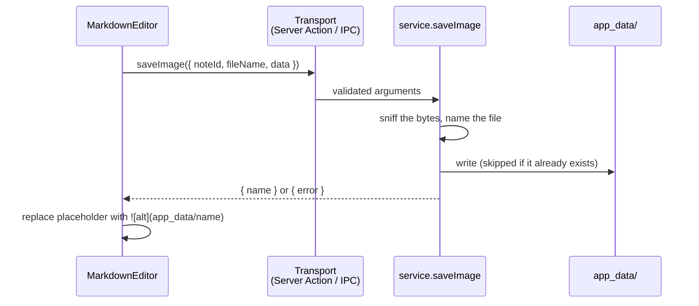

# Images

Source: [`images.ts`](../../apps/web/src/lib/composition/images.ts),
[`imageRefs.ts`](../../apps/web/src/lib/composition/imageRefs.ts),
[`NoteImage.tsx`](../../apps/web/src/components/notes/NoteImage.tsx),
[`mdx/Image.tsx`](../../apps/web/src/components/notes/mdx/Image.tsx),
[`MarkdownEditor.tsx`](../../apps/web/src/components/notes/MarkdownEditor.tsx); in the CLI,
[`images.ts`](../../apps/cli/src/images.ts),
[`PreviewImage.tsx`](../../apps/cli/src/components/PreviewImage.tsx)

Images in notes are supported in the **web and desktop apps**, which can paste them. The CLI
shows them in its preview ([In the CLI](#in-the-cli)) but cannot paste one.

## What a note contains

An image is ordinary Markdown whose path is `app_data/<file name>`:

```

```

The bytes are not in the database. They are a file in `app_data/` inside the
[application data directory](data-model.md#storage-location), next to
`composition.db`:

```
~/.composition/
├── composition.db
└── app_data/
    └── trip-plan-route-map-3f9c2a71b0de.png
```

Because the note stores only the relative path, a note's images follow it as long
as `app_data/` sits beside the database that holds the note.

## Pasting

Pasting an image into the editor (a screenshot, or "copy image" from a browser)
uploads it and inserts the Markdown at the caret, replacing any selection.
While the upload runs, a `[Uploading …]` placeholder marks the spot. If the upload
fails the placeholder is removed and the reason is shown above the editor.

A paste that carries text as well as an image (cells copied from a spreadsheet, for
instance) is left to the browser as ordinary text.



`saveImage` is part of the `CompositionApi` contract ([api.ts](../../apps/web/src/lib/composition/api.ts)),
so both transports carry it. Reading images back is **not** in the contract; it is a
plain URL (below).

## File names

`<note title>-<image file name>-<content hash>.<ext>`, for example
`trip-plan-route-map-3f9c2a71b0de.png`.

- The title and file name are lower-cased, reduced to `a-z0-9-`, and truncated to 40
  characters each. A pasted screenshot is usually just `image.png`, so the note's
  title is what makes the name recognisable.
- The hash is the first 12 hex digits of the SHA-256 of the bytes. Two different
  images never share a name, even from the same note with the same file name, and
  pasting the *same* image into the same note again reuses the existing file.
- The extension comes from the bytes (PNG, JPEG, GIF, WebP), never from the claimed
  file name or MIME type. Anything else is refused, as is an empty file. SVG is refused
  on purpose: it can carry script.
- **Size:** the web app refuses images over 10 MB (`MAX_IMAGE_BYTES`, and a 12 MB
  Server Action body limit in `next.config.ts` to carry them). The desktop app has no
  limit: the image never leaves the user's machine. The editor's check is per build
  (`imageLimit.ts` / `imageLimit.desktop.ts`); the main process lifts the server-side
  one with `service.setMaxImageBytes(null)`.

The title is read when the image is pasted. Renaming the note later leaves the
file name as it was.

## Showing images

The preview renders Markdown images with `NoteImage`, which react-markdown uses in
place of a plain ``. The `<Image src alt />` [MDX component](../ui/mdx-components.md)
is the same component written as a tag:

| `src` in the note          | Shown from                                              |
| -------------------------- | ------------------------------------------------------- |
| `app_data/<name>`          | this app's own image URL, below                         |
| `https://…`, `data:…`, etc | as written                                              |
| `app_data/<name>`, missing | the alt text, as "Image not found: …"                   |

`app_data/<name>` is resolved by `imageUrl()`, which differs per build:

- **Web:** `/app_data/<name>`, a route handler
  ([`route.ts`](../../apps/web/src/app/app_data/[name]/route.ts)).
- **Desktop:** `app://composition/app_data/<name>`, served by the `app://` protocol
  handler in the main process ([`protocol.ts`](../../apps/desktop/src/main/protocol.ts)).
  A static export has no route handlers, so the web route does not exist in that build.

Both serve through `service.readImage`, which only accepts a single path segment with
an image extension (so `..` and other files in the directory are a 404) and looks in
whichever application data directory is configured at that moment. Responses carry
`nosniff` and a long `immutable` cache lifetime, safe because names embed a content hash.

## In the CLI

The terminal app shows a note's stored images in its preview. It can't paste one (that is a
browser feature), so images come from the web or desktop app. Which images get drawn is decided
in [`mdx.ts`](../../apps/cli/src/mdx.ts), alongside the [MDX components](../ui/mdx-components.md).

| In the note | In the terminal |
|---|---|
| `` or `<Image src="app_data/<name>" />`, alone in its paragraph (several, one per line, is fine) | The picture |
| …when the file is missing | `Image not found: alt` (the file name, with no alt text) |
| …when the file isn't an image the decoder takes | `Can’t display this image: alt` |
| `https://…`, `data:…` | The alt text. The CLI never fetches an image, so opening a note makes no network request |
| An image inside a sentence, a list item, a quote or a link | The alt text: a picture can't sit in a line of text |

**How it is drawn.** By OpenTUI's `<image>`: with the Kitty graphics protocol where the terminal
has it (Kitty and Ghostty, for instance), with Sixel where the terminal reports that, and
otherwise, and always under tmux, in quadrant block characters (`▘▚▟` and the like): each cell is a
2x2 grid of pixels in two colors. That works in any terminal with colors, but a cell can only hold
two colors, so it is coarser than a real picture, most of all on fine detail. The image is first
averaged down to exactly that grid (see `pixelsForCells`): handed a larger one, OpenTUI picks pixels
out of it instead of averaging them, which turns text and edges into noise.

Set `COMPOSITION_IMAGE_PROTOCOL` to `auto` (the default), `blocks`, `kitty` or `sixel` to choose.

**How big.** As wide as the pane and no taller than about 60% of the screen, keeping its
proportions, and never larger than its own pixels, so an icon isn't blown up. An image is shrunk to
1,600 pixels on its longer side when it is loaded, and the last 16 are kept, so scrolling back to
one, or opening the note in a second pane, doesn't decode it again. PNG, JPEG, GIF and WebP are
shown, the four the apps store; nothing is animated. Under the Kitty protocol, OpenTUI removes a
picture's placement while the help overlay is open and puts it back when it closes.

## Gaps

- Images are never deleted: removing a note, or the image's line from it, leaves the
  file in `app_data/`.
- Changing **Application data location** in the web and desktop apps only points them
  at a new directory; nothing is moved. Images are then looked up in the new
  `app_data/`, so copy that folder along with `composition.db`.
- Images can only be added by pasting, and only in the web and desktop apps; drag-and-drop and a
  file picker are not wired up, and the CLI cannot add one.
- In the CLI, the block-character drawing is covered by tests, including one that compares what is
  drawn with the best the grid allows. The Kitty path was only checked by running
  the built app against a terminal that answers like Kitty and reading the graphics commands it
  sent, and Sixel, which is OpenTUI's own, not at all. If a terminal draws one of them wrongly,
  `COMPOSITION_IMAGE_PROTOCOL=blocks` avoids it.

## Backups

**Settings → Backup** includes every file in `app_data/`, and **Restore** puts them back, so the
images in restored notes still show; see [backup-restore.md](backup-restore.md).
