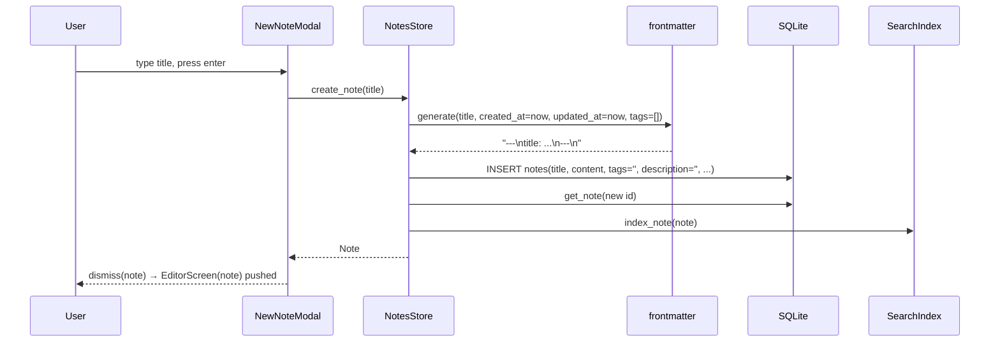
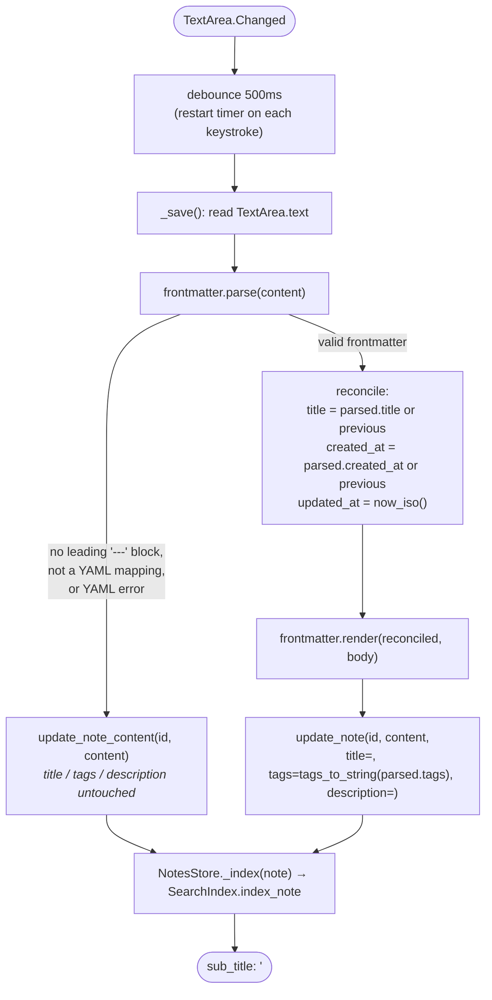

# Note lifecycle: create, edit, autosave

Source: [`storage.py`](../../src/composition/storage.py),
[`frontmatter.py`](../../src/composition/frontmatter.py),
[`screens/editor_screen.py`](../../src/composition/screens/editor_screen.py),
[`screens/new_note_modal.py`](../../src/composition/screens/new_note_modal.py)

This is the most intricate flow in the app: every keystroke in the editor can, after a
debounce, round-trip through the YAML frontmatter parser before it reaches the
database. Understanding the two save paths below is the key to understanding the whole
metadata feature.

## Create

Every new note starts life with a generated frontmatter block already in its
`content` — there's never a note with zero frontmatter unless a user deliberately
deletes the block while editing.

## Autosave

`EditorScreen` debounces `TextArea.Changed` by 500ms (`AUTOSAVE_DELAY`) before calling
`_save()`. That method's job is to reconcile whatever frontmatter the user is currently
typing back into the `Note` object and the database — and it must never crash or lose
data, even if the user is mid-edit of the YAML block itself.

The two branches matter because a user can be in the middle of typing (or deleting)
the frontmatter block itself. Rather than guess at intent from half-typed YAML, the
fallback path leaves the DB's `title`/`tags`/`description` columns exactly as they
were and only persists the raw text — metadata resyncs automatically as soon as the
frontmatter becomes valid YAML again. This contract is pinned by
`test_update_note_syncs_title_tags_description_and_reindexes` and
`test_update_note_content_does_not_touch_title_tags_description` in
[`tests/test_storage.py`](../../tests/test_storage.py).

Pressing `escape` (`action_back`) flushes any pending debounced save immediately
before popping back to `MainScreen`, so navigating away never drops the last few
keystrokes.

## Which store method does what

| Method | When | Effect |
|---|---|---|
| `create_note(title, tags="")` | New note modal submits | Generates fresh frontmatter, inserts row, indexes. |
| `update_note(id, content, *, title, tags, description)` | Autosave, valid frontmatter | Full sync: content + all metadata columns, reindexes. |
| `update_note_content(id, content)` | Autosave, missing/malformed frontmatter | Content + `updated_at` only; metadata columns untouched. |
| `delete_note(id)` | Delete confirmed | Removes row, best-effort removes from search index. |
