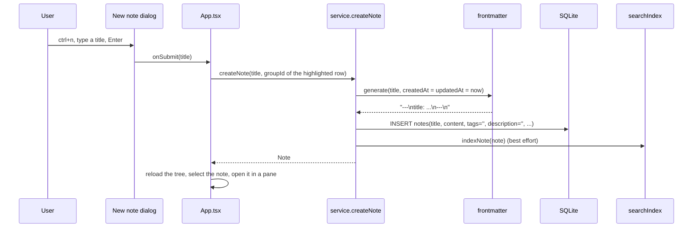
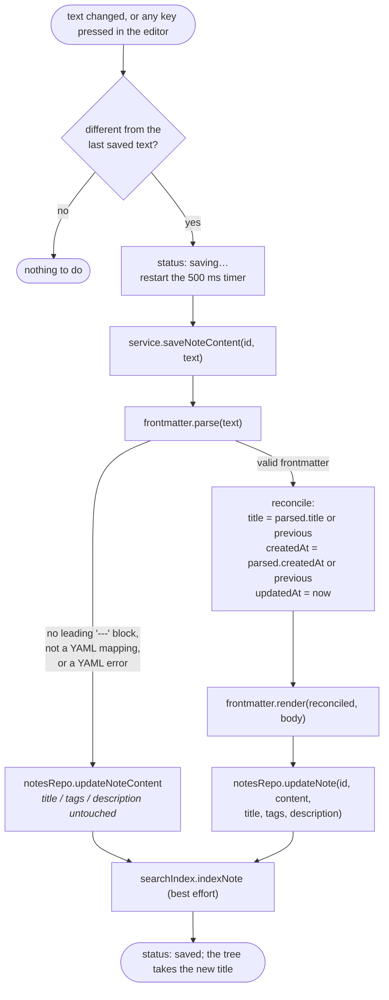

# Note lifecycle: create, edit, autosave

Source: [`components/Pane.tsx`](../../apps/cli/src/components/Pane.tsx),
[`App.tsx`](../../apps/cli/src/App.tsx),
[`service.ts`](../../apps/web/src/lib/composition/service.ts),
[`frontmatter.ts`](../../apps/web/src/lib/composition/frontmatter.ts),
[`notesRepo.ts`](../../apps/web/src/lib/composition/notesRepo.ts)

This is the most intricate flow in the app: every keystroke in the editor can, after a
debounce, round-trip through the YAML frontmatter parser before it reaches the database.
Understanding the two save paths below is the key to understanding the whole metadata feature.
The saving itself is the web and desktop apps' code, shared: `service.saveNoteContent`.

## Create

```mermaid
sequenceDiagram
    participant User
    participant Dlg as New note dialog
    participant App as App.tsx
    participant Svc as service.createNote
    participant FM as frontmatter
    participant DB as SQLite
    participant Idx as searchIndex

    User->>Dlg: ctrl+n, type a title, Enter
    Dlg->>App: onSubmit(title)
    App->>Svc: createNote(title, groupId of the highlighted row)
    Svc->>FM: generate(title, createdAt = updatedAt = now)
    FM-->>Svc: "---\ntitle: ...\n---\n"
    Svc->>DB: INSERT notes(title, content, tags='', description='', ...)
    Svc->>Idx: indexNote(note)  (best effort)
    Svc-->>App: Note
    App->>App: reload the tree, select the note, open it in a pane
```

Every new note starts life with a generated frontmatter block already in its `content`. There is
never a note with zero frontmatter unless a user deliberately deletes the block while editing.

## Autosave

Each open pane owns its text editor. After the text changes, the pane waits 500 ms
(`AUTOSAVE_DELAY_MS`) before saving; every keystroke restarts the wait. Saving reconciles
whatever frontmatter the user is currently typing back into the note and the database, and it must
never crash or lose data, even if the user is in the middle of editing the YAML block itself.

```mermaid
flowchart TD
    Change(["text changed, or any key pressed in the editor"]) --> Same{"different from the<br/>last saved text?"}
    Same -- "no" --> Idle(["nothing to do"])
    Same -- "yes" --> Debounce["status: saving…<br/>restart the 500 ms timer"]
    Debounce --> Save["service.saveNoteContent(id, text)"]
    Save --> Parse["frontmatter.parse(text)"]

    Parse -- "no leading '---' block,<br/>not a YAML mapping,<br/>or a YAML error" --> Fallback["notesRepo.updateNoteContent<br/><i>title / tags / description untouched</i>"]
    Parse -- "valid frontmatter" --> Reconcile["reconcile:<br/>title = parsed.title or previous<br/>createdAt = parsed.createdAt or previous<br/>updatedAt = now"]

    Reconcile --> Render["frontmatter.render(reconciled, body)"]
    Render --> Sync["notesRepo.updateNote(id, content,<br/>title, tags, description)"]

    Fallback --> Index["searchIndex.indexNote (best effort)"]
    Sync --> Index
    Index --> Done(["status: saved; the tree takes the new title"])
```

The two branches matter because a user can be in the middle of typing (or deleting) the
frontmatter block itself. Rather than guess at intent from half-typed YAML, the fallback path
leaves the database's `title`/`tags`/`description` columns exactly as they were and only persists
the raw text. Metadata resyncs automatically as soon as the frontmatter becomes valid YAML again.
That contract is pinned by `service.test.ts` in the web app ("creates a note, reconciles edited
frontmatter into its columns" and "falls back to a raw content save when the frontmatter is
mid-edit and invalid").

### Why the pane looks after every key, not only after a change

OpenTUI's text editor reports a change to the text through `onContentChange`, but **not** when the
change is an undo or a redo. A save hooked only to that event would quietly miss the most
important keystroke: you type, it saves, you press undo, and the undone text is never written. So
the pane also checks the text a moment after every key, and saves if it differs from what it last
saved. `App.test.tsx` has a test that types, undoes, and reads the database.

### Not losing the last keystrokes

A pending save is flushed, not dropped, whenever the pane is about to go away:

- the pane is closed, or another note replaces it (the pane's cleanup saves);
- the app quits with `q` or `ctrl+c` (every pane registers a flush with the app first).

## Which method does what

| Method | When | Effect |
|---|---|---|
| `service.createNote(title, groupId)` | New note dialog submits | Generates fresh frontmatter, inserts the row, indexes it. |
| `service.saveNoteContent(id, text)` | Autosave | Valid frontmatter: content and all metadata columns together. Missing or malformed: content and `updatedAt` only. Then indexes. |
| `service.deleteNote(id)` | Delete confirmed | Moves the note to the Trash Can (its own tables) and takes it out of the search index. |
| `service.restoreNote(id)` | Restored from the Trash screen | Back into its group (or the top level), and back into the index. |
| `service.permanentlyDeleteNote(id)` | Deleted for good | Erases the row, and the note's attachments once nothing refers to them. |

(The Python CLI that preceded this app erased a deleted note at once. The Trash Can is the
behavior of the web and desktop apps, which the terminal app now shares.)
