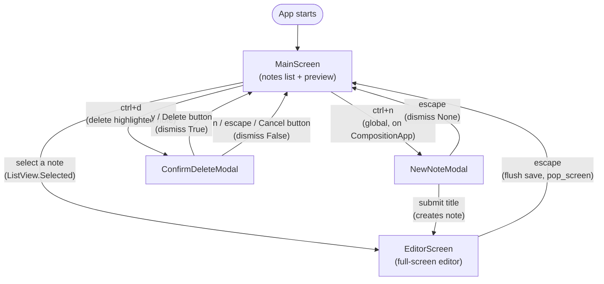

# Screen navigation

Source: [`app.py`](../../src/composition/app.py),
[`screens/main_screen.py`](../../src/composition/screens/main_screen.py),
[`screens/editor_screen.py`](../../src/composition/screens/editor_screen.py),
[`screens/new_note_modal.py`](../../src/composition/screens/new_note_modal.py),
[`screens/delete_note_modal.py`](../../src/composition/screens/delete_note_modal.py)

Composition uses Textual's screen stack (`push_screen`/`pop_screen`) rather than a
static route table. `MainScreen` is the only screen that's ever the base of the stack;
everything else is pushed on top of it and popped or dismissed back off.

## Flow

Note that `ctrl+n` is bound on `CompositionApp` itself (a global binding), not on
`MainScreen` — it works from anywhere `MainScreen` is the active screen, and pushes
straight to `EditorScreen`, bypassing `MainScreen`'s list until the user backs out of
the editor and `on_screen_resume` re-syncs it.

## Key bindings

| Scope | Key | Action |
|---|---|---|
| `CompositionApp` (global) | `ctrl+n` | New note → `NewNoteModal` |
| `CompositionApp` (global) | `q` | Quit |
| `MainScreen` | `ctrl+d` | Delete highlighted note → `ConfirmDeleteModal` |
| `MainScreen` | `ctrl+space` | Focus the search input |
| `EditorScreen` | `escape` | Flush pending autosave, back to `MainScreen` |
| `NewNoteModal` | `enter` (on title input) | Create note, push `EditorScreen` |
| `NewNoteModal` | `escape` | Cancel, dismiss with `None` |
| `ConfirmDeleteModal` | `y` / Delete button | Confirm, dismiss `True` |
| `ConfirmDeleteModal` | `n` / `escape` / Cancel button | Cancel, dismiss `False` |

`MainScreen` sets `AUTO_FOCUS = "#notes-list"` instead of Textual's default (which
would focus the search `Input` first, since it's composed before the list). If the
search input had default focus, its own built-in `ctrl+d` binding (delete-char-right)
would shadow the screen's delete-note action before the user ever typed anything.

## Returning to `MainScreen`

`MainScreen.on_screen_resume` fires every time a pushed screen is popped back to it
(returning from the editor, or a modal dismissing). It re-runs the active search query
if the search box has text, otherwise reloads the full notes list — so edits made in
`EditorScreen` (title changes, deletions) are always reflected immediately.
