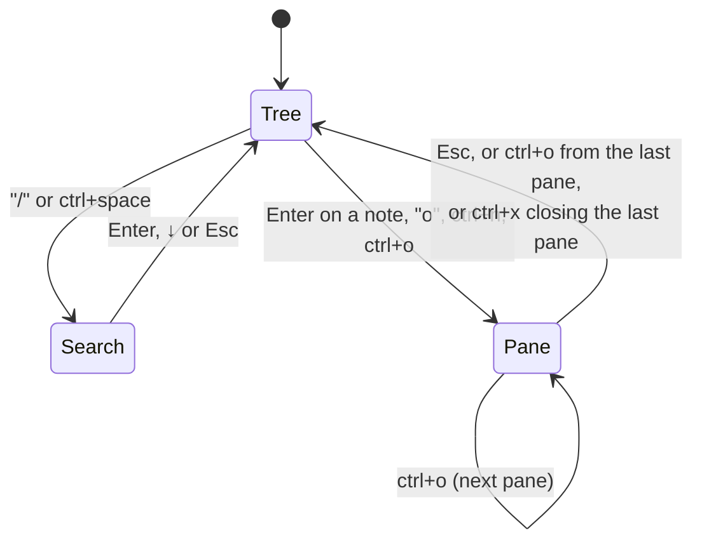
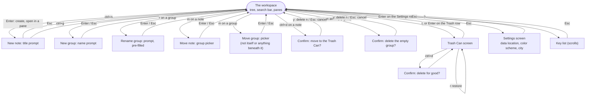

# Screen navigation

Source: [`App.tsx`](../../apps/cli/src/App.tsx),
[`keymap.ts`](../../apps/cli/src/keymap.ts),
[`tree.ts`](../../apps/cli/src/tree.ts),
[`components/`](../../apps/cli/src/components)

The terminal app has one workspace and a handful of things that open on top of it. It does not
use a stack of screens, and nothing replaces the workspace: the tree and the open notes stay
mounted underneath, so an editor keeps its cursor and undo history while you look in the Trash Can.

The model is the web and desktop app's: a sidebar tree plus a single row of side-by-side panes,
each showing one note as its editor, its preview, or both. There is no separate full-screen editor.
The full list of keys is in [cli-keybindings.md](../ui/cli-keybindings.md).

## Focus areas

Keyboard input always goes to exactly one of three places in the workspace:

```mermaid
stateDiagram-v2
    [*] --> Tree
    Tree --> Search: "/" or ctrl+space
    Search --> Tree: Enter, ↓ or Esc
    Tree --> Pane: Enter on a note, "o", ctrl+n, ctrl+o
    Pane --> Pane: ctrl+o (next pane)
    Pane --> Tree: Esc, or ctrl+o from the last pane,<br/>or ctrl+x closing the last pane
```

| Focus | What handles keys | Plain letters do |
|---|---|---|
| **Tree** | `App.tsx`, through `keymap.ts` (scope `tree`); the list widget moves the cursor itself | Act: `o`, `m`, `r`, `f`, `t`, `q` … |
| **Search bar** | The input widget; the app only watches for Enter, ↓ and Esc | Type, so `q` is a letter here |
| **A pane** | The text editor; the app only watches `Esc`, `ctrl+o`, `ctrl+t`, `ctrl+x` and `ctrl+n` | Type |

The rule behind this is "keys inside the editor always win": a binding is never taken from the
editor, and [`keymap.test.ts`](../../apps/cli/src/keymap.test.ts) fails if one collides with a key
OpenTUI's text editor already uses.

## What opens on top

Everything below is one `dialog` state in `App.tsx`. While one is open the workspace is not
focused at all (every widget under it gets `focused={false}`), so no key can leak through to it,
and the only global key is `ctrl+c`, which quits.

```mermaid
flowchart TD
    Work(["The workspace<br/>tree, search bar, panes"])

    Work -- "ctrl+n" --> NewNote["New note: title prompt"]
    NewNote -- "Enter: create, open in a pane" --> Work
    NewNote -- "Esc" --> Work

    Work -- "ctrl+g" --> NewGroup["New group: name prompt"]
    Work -- "r on a group" --> Rename["Rename group: prompt, pre-filled"]
    Work -- "m on a note" --> MoveNote["Move note: group picker"]
    Work -- "m on a group" --> MoveGroup["Move group: picker<br/>(not itself or anything beneath it)"]
    NewGroup & Rename & MoveNote & MoveGroup -- "Enter / Esc" --> Work

    Work -- "ctrl+d on a note" --> DelNote["Confirm: move to the Trash Can?"]
    Work -- "ctrl+d on an empty group" --> DelGroup["Confirm: delete the empty group?"]
    DelNote & DelGroup -- "y: delete   n / Esc: cancel" --> Work

    Work -- "t, or Enter on the Trash row" --> Trash["Trash Can screen"]
    Trash -- "r restore" --> Trash
    Trash -- "ctrl+d" --> Forever["Confirm: delete for good?"]
    Forever --> Trash
    Trash -- "Esc" --> Work

    Work -- "Enter on the Settings row" --> Settings["Settings screen<br/>data location, color scheme, city"]
    Settings -- "Esc" --> Work

    Work -- "?" --> Help["Key list (scrolls)"]
    Help -- "Esc" --> Work
```

The Trash Can and Settings are drawn as full-screen overlays, the rest as centered boxes. Closing
the Trash Can reloads the workspace, so a restored note is back in the tree.

`ctrl+d` on a non-empty group shows a message in the footer instead of a confirmation, and `r`, `m` and
`ctrl+d` do nothing on the "Ungrouped" bucket, the Trash row, the Settings row or a message row,
none of which is a real note or group.

## Opening notes into panes

The pane arrangement is the web app's, imported as-is ([`panes.ts`](../../apps/web/src/components/notes/panes.ts)):

- each note is open in at most one pane, and panes sit in one row;
- **Enter** puts the note in the focused pane (or focuses the pane it is already in);
- **`o`** puts it in a new pane to the right of the focused one;
- **`ctrl+x`** closes the pane, giving its width to its neighbour;
- the arrangement is not saved: the next run starts with no panes, as on the web.

A pane shows `split` (editor and preview side by side), `editor` or `preview`; `ctrl+t` cycles them.
A pane narrower than 80 columns shows the editor instead of `split`, rather than squeezing two
columns into it, the same fallback the web app has.

## Returning to the tree

Going back to the tree (Esc, leaving a pane, closing a screen) reloads the notes and groups from
SQLite. That is when a note you just edited moves to the top of its group: while you are typing the
tree is kept in step (a title changed in the frontmatter shows up) but never reordered under you.
An active search stays applied, so coming back from a note opened from the results leaves them as
they were.
