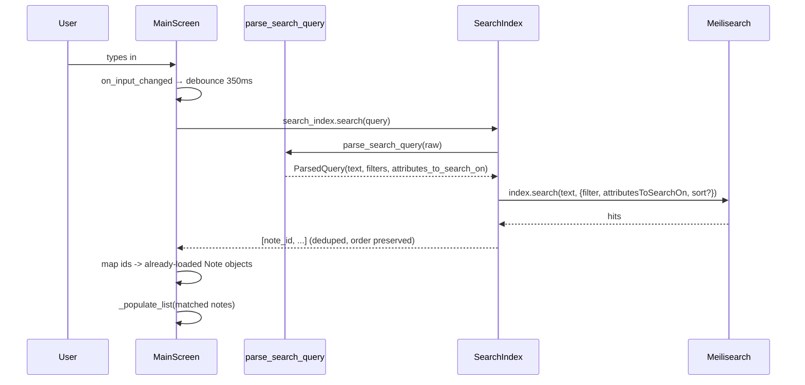
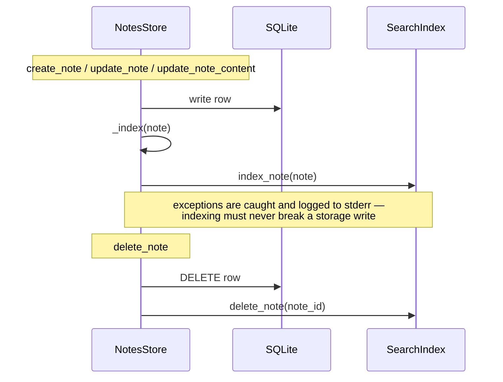

# Search

Source: [`search.py`](../../apps/cli/src/composition/search.py),
[`screens/main_screen.py`](../../apps/cli/src/composition/screens/main_screen.py),
[`storage.py`](../../apps/cli/src/composition/storage.py)

Search is fuzzy full-text search over titles and content, plus structured filter
tokens (`tag:`, `title:`, `createdOn:`), served by a local Meilisearch index that
`NotesStore` keeps in sync with SQLite on every write.

## Query flow

If `search_index.search()` raises for any reason, `MainScreen._run_search` swallows
the exception and leaves the list as-is — a flaky or restarting search backend
degrades to "stale results" rather than crashing the UI.

When the query is empty, `MainScreen` skips search entirely and calls
`_refresh_notes()`, which lists straight from SQLite ordered by `updated_at DESC`.

## Query syntax

`parse_search_query` (a pure function, no network calls) recognizes filter tokens
anywhere in the string and treats everything else as free text:

| Token | Example | Becomes |
|---|---|---|
| `tag:<value>` | `tag:software` | Meilisearch filter `tags = "software"` |
| `title:<value>` | `title:Next.js` | Narrows `attributesToSearchOn` to `["title"]`; value also joins the free-text query |
| `createdOn:[op]<date>` | `createdOn:>=2026-05-30` | Filter on `created_at_ts`; `op` is one of `>`, `>=`, `<`, `<=`, `=` (default `=`, matching the whole day) |

Multiple filter tokens combine with `AND`. A malformed `createdOn:` date (fails the
`YYYY-MM-DD` pattern) is left in place as literal search text instead of raising, so a
half-typed date degrades to "no matches" rather than breaking the debounced handler
mid-keystroke.

## Keeping the index in sync

SQLite is the source of truth; Meilisearch holds a derived index that `NotesStore`
pushes to on every mutation:

Because the index is fully derived, `SearchIndex.reindex_all(notes)` can blow it away
and rebuild it from the SQLite rows at any time — this runs once at startup (see
[startup.md](startup.md)) and is the same mechanism `apps/cli/scripts/search_playground.py`
uses to exercise search against a throwaway index.
