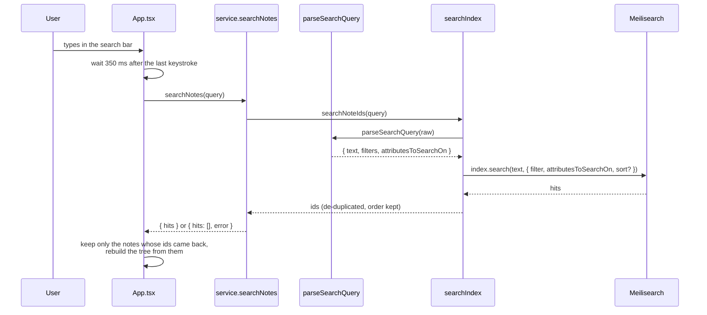
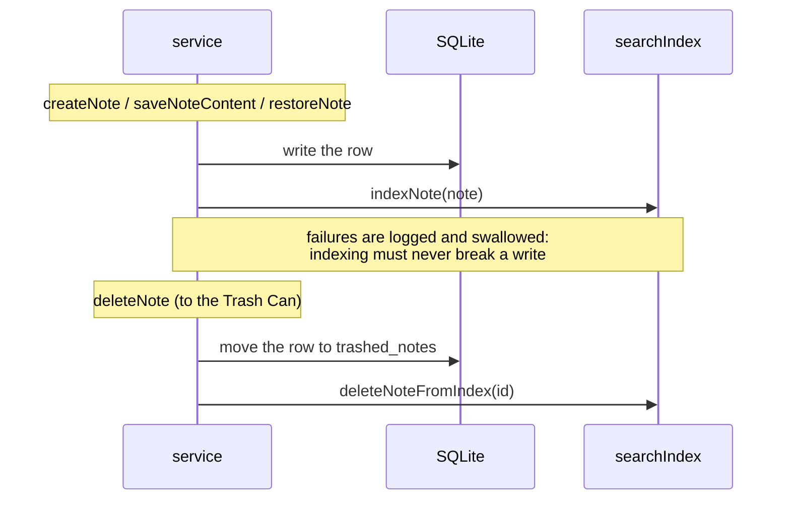

# Search

Source: [`searchQuery.ts`](../../apps/web/src/lib/composition/searchQuery.ts),
[`searchIndex.ts`](../../apps/web/src/lib/composition/searchIndex.ts),
[`service.ts`](../../apps/web/src/lib/composition/service.ts) (`searchNotes`),
[`App.tsx`](../../apps/cli/src/App.tsx) (the terminal app's search bar),
[`runtime.ts`](../../apps/cli/src/runtime.ts) (starting Meilisearch),
[`meili.ts`](../../apps/desktop/src/main/meili.ts) (the process)

Search is fuzzy full-text search over titles, descriptions and content, plus structured filter
tokens (`tag:`, `title:`, `created:` …), served by a local Meilisearch index that is kept in sync
with SQLite on every write. The terminal, web and desktop apps all use the same query parser,
index shape and `searchNotes` function; they differ in who starts Meilisearch (below).

## Query flow (terminal app)

```mermaid
sequenceDiagram
    participant User
    participant App as App.tsx
    participant Svc as service.searchNotes
    participant Parse as parseSearchQuery
    participant Idx as searchIndex
    participant Meili as Meilisearch

    User->>App: types in the search bar
    App->>App: wait 350 ms after the last keystroke
    App->>Svc: searchNotes(query)
    Svc->>Idx: searchNoteIds(query)
    Idx->>Parse: parseSearchQuery(raw)
    Parse-->>Idx: { text, filters, attributesToSearchOn }
    Idx->>Meili: index.search(text, { filter, attributesToSearchOn, sort? })
    Meili-->>Idx: hits
    Idx-->>Svc: ids (de-duplicated, order kept)
    Svc-->>App: { hits } or { hits: [], error }
    App->>App: keep only the notes whose ids came back,<br/>rebuild the tree from them
```

A search never throws into the UI. If Meilisearch is down or was never started, `searchNotes`
returns `{ hits: [], error }` with the reason (for instance, that the binary wasn't found), the
terminal app shows it in its header and leaves the tree as it was. A search that is
still waiting when a newer one starts is discarded when it comes back, so slow answers cannot
overwrite fast ones.

While a search is filtering the tree, groups with no matching note below them are left out and
the Favorites section is hidden; with no match at all the tree says `No notes match.` An empty
search bar lists everything from SQLite, most recently edited first, without asking Meilisearch.

## Query syntax

`parseSearchQuery` is a pure function (no network), so it is safe to run on every debounced
keystroke. It recognizes `field: value` anywhere in the query, case-insensitive field names, space
after the colon optional, and treats everything else as free text:

| Field | Example | Matches |
|---|---|---|
| `tags:` / `tag:` | `tags: web development` | notes with exactly that tag (tag matching ignores case) |
| `title:` | `title: routng` | typo-tolerant search over titles only |
| `description:` | `description: ownership` | typo-tolerant search over descriptions only |
| `created:` / `createdAt:` / `createdOn:` | `created: >=2026-05-30` | creation date; operators `>`, `>=`, `<`, `<=`, `=` (default `=`, the whole UTC day) |
| `updated:` / `updatedAt:` / `updatedOn:` | `updated: <2026-01-01` | same, for the last-modified date |

- An unquoted value runs up to the next `field:` or the end of the query, so `tags: web development`
  is the one tag "web development". To follow a value with free text, put the text first
  (`async tags: web development`) or quote the value (`tags:"web development" async`).
- Repeating a field, or combining fields, ANDs them. `title:` and `description:` are the
  exception: Meilisearch can't scope individual words to an attribute, so their values and any
  free text are joined into one query over the named attributes.
- A field with no value yet (`tags:`) is ignored. A malformed date stays as literal text, so it
  finds nothing instead of silently dropping the constraint, and a half-typed date degrades to "no
  matches" rather than breaking the handler mid-keystroke.
- Results are capped at 50. A query with filters but no text lists matches newest first
  (`updated_at_ts:desc`).

(The Python CLI that preceded the terminal app understood only `tag:`, `title:` and `createdOn:`.)

## The index

One Meilisearch index, `notes`, with the note id as primary key and the title, description,
content, tags and creation and update times as documents. Title, content and description are
searchable; tags and the timestamps are filterable; the update time is sortable.

SQLite is the source of truth and the index is derived, so it can be thrown away and rebuilt at any
time:

- `searchIndex.reindexAll(notes)` empties it and re-adds every note. The terminal app does this
  in the background at every start (`SearchSidecar.start`, see [startup.md](startup.md)), and again
  after the data location changes.
- If the index has no documents, or the server was started fresh, the first search of a run
  rebuilds it, so a stale or empty index is never shown as "no matches". A document shape change
  (the `description` field was added) is handled the same way.

```mermaid
sequenceDiagram
    participant Svc as service
    participant DB as SQLite
    participant Idx as searchIndex

    Note over Svc: createNote / saveNoteContent / restoreNote
    Svc->>DB: write the row
    Svc->>Idx: indexNote(note)
    Note over Svc,Idx: failures are logged and swallowed:<br/>indexing must never break a write

    Note over Svc: deleteNote (to the Trash Can)
    Svc->>DB: move the row to trashed_notes
    Svc->>Idx: deleteNoteFromIndex(id)
```

## Who runs Meilisearch

Each product keeps its own index, and none shares a Meilisearch data directory with another, so two
server processes never fight over one index:

| | Terminal app | Web app | Desktop app |
|---|---|---|---|
| Meilisearch | spawned by the app (`MeiliProcessManager`), random port | started by hand, `pnpm meili`, port 7700 | spawned by the app, bundled binary, random port |
| Binary | `meilisearch` on the `PATH`, or `COMPOSITION_MEILI_BIN` | the same, run by hand | bundled in the app |
| Data | `<app data>/meili_data` (default `~/.composition/meili_data`) | `~/.composition-web/meili_data` | under the app's own data folder |

The web app connects to `MEILI_URL` (default `http://127.0.0.1:7700`) with `MEILI_MASTER_KEY` or the
key file at `~/.composition/meili_master_key`. A search that can't reach Meilisearch comes back as an
error the UI shows, never as "No matches".

Developer tools for trying search against a throwaway index: `pnpm search:playground` in
`apps/cli` loads 100 dummy notes into a temporary database and Meilisearch of its own, and gives a
`search>` prompt; `pnpm seed` writes the same dummy notes into a scratch home you can open with
`COMPOSITION_DEV_HOME=<folder> pnpm dev`.
