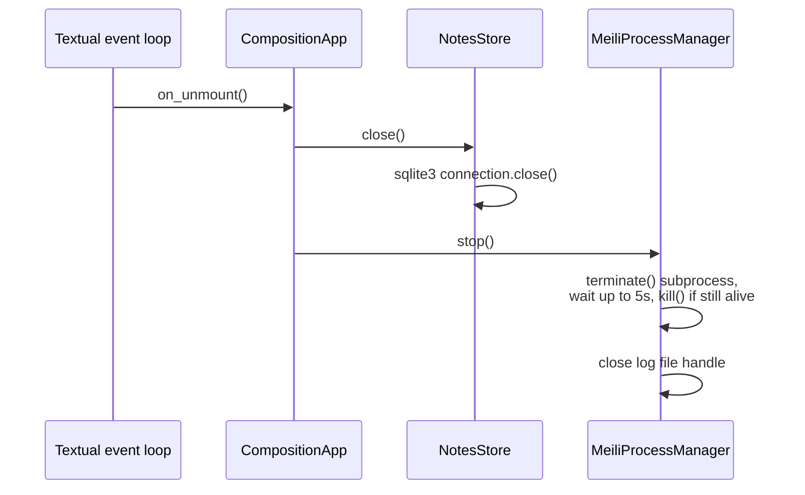

# Startup & shutdown

Source: [`src/composition/app.py`](../../src/composition/app.py)

Composition is a single process. Starting it means: load the configured application
data directory, find a free port, launch a local Meilisearch server using that
directory, point a search client at it, open the colocated SQLite database, and only
then hand control to Textual's event loop.

## Sequence

```mermaid
sequenceDiagram
    participant CLI as main()
    participant App as CompositionApp.__init__
    participant Meili as MeiliProcessManager
    participant Idx as SearchIndex
    participant Store as NotesStore
    participant TUI as Textual event loop

    CLI->>App: construct CompositionApp()
    App->>App: load settings and upgrade legacy data layout
    App->>Meili: start()
    Meili->>Meili: find free port, load/create master key
    Meili->>Meili: spawn `meilisearch` subprocess
    Meili-->>Meili: poll health() until ready (10s timeout)
    Meili-->>App: MeiliServerHandle(url, master_key)
    App->>Idx: SearchIndex(url, master_key)
    App->>Idx: ensure_index()
    Idx-->>Idx: create "notes" index if missing,<br/>set searchable/filterable/sortable attrs
    App->>Store: NotesStore(search_index=Idx)
    Store-->>Store: open &lt;app data&gt;/composition.db,<br/>create schema, run column migrations
    App->>Idx: reindex_all(store.list_notes())
    App-->>CLI: app instance ready
    CLI->>TUI: app.run()
    TUI->>TUI: on_mount() → push_screen(MainScreen())
```

If `MeiliProcessManager.start()` fails to produce a healthy server within its 10-second
timeout, or the `meilisearch` binary isn't on `PATH`, `__init__` raises
`MeiliBinaryNotFoundError` or `MeiliProcessError`. `main()` catches both, prints the
error to stderr, and exits with status 1 — the TUI never starts.

Tests can skip all of this by constructing `CompositionApp(search_index=...)` directly
with a fake index (see `tests/_doubles.py`); in that case the app never owns a
Meilisearch subprocess and won't try to stop one on shutdown.

Settings written by older versions contain a standalone `db_path`. On the first
startup after upgrading, Composition uses that database's parent as the application
data directory, moves the legacy Meilisearch files and settings into it, renames the
database to `composition.db` when necessary, and writes the unified setting.

## Shutdown



`on_unmount` runs whenever the app exits (`q`, Ctrl+C, or a fatal error inside the
event loop), so the SQLite connection and the Meilisearch subprocess are always given a
chance to shut down cleanly rather than being left as orphans.
