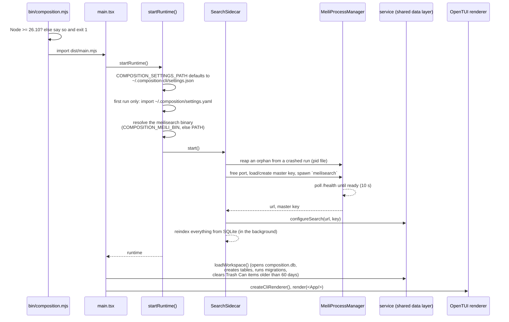

# Startup & shutdown

Source: [`bin/composition.mjs`](../../apps/cli/bin/composition.mjs),
[`src/main.tsx`](../../apps/cli/src/main.tsx),
[`src/runtime.ts`](../../apps/cli/src/runtime.ts),
[`src/legacySettings.ts`](../../apps/cli/src/legacySettings.ts)

Composition is a single process. Starting it means: check the Node version, find the settings,
launch a local Meilisearch server in the configured application data directory, point the search
code at it, open the SQLite database, and only then draw the UI.

## Sequence

```mermaid
sequenceDiagram
    participant Bin as bin/composition.mjs
    participant Main as main.tsx
    participant RT as startRuntime()
    participant Side as SearchSidecar
    participant Meili as MeiliProcessManager
    participant Svc as service (shared data layer)
    participant UI as OpenTUI renderer

    Bin->>Bin: Node >= 26.10? else say so and exit 1
    Bin->>Main: import dist/main.mjs
    Main->>RT: startRuntime()
    RT->>RT: COMPOSITION_SETTINGS_PATH defaults to<br/>~/.composition-cli/settings.json
    RT->>RT: first run only: import ~/.composition/settings.yaml
    RT->>RT: resolve the meilisearch binary<br/>(COMPOSITION_MEILI_BIN, else PATH)
    RT->>Side: start()
    Side->>Meili: reap an orphan from a crashed run (pid file)
    Side->>Meili: free port, load/create master key, spawn `meilisearch`
    Meili-->>Meili: poll /health until ready (10 s)
    Meili-->>Side: url, master key
    Side->>Svc: configureSearch(url, key)
    Side-->>Side: reindex everything from SQLite (in the background)
    RT-->>Main: runtime
    Main->>Svc: loadWorkspace()  (opens composition.db,<br/>creates tables, runs migrations,<br/>clears Trash Can items older than 60 days)
    Main->>UI: createCliRenderer(), render(<App/>)
```

Unlike the Python app this replaced, **a missing or broken Meilisearch does not stop the app from
starting.** `SearchSidecar.start()` never throws: if there is no binary on the `PATH`, or the server
does not become healthy in time, search is marked unavailable with a reason, and a search says
why (`Search is unavailable: the Meilisearch binary wasn't found…`). Notes keep working, because
search is derived data and SQLite is the source of truth.

The settings file is the CLI's own, `~/.composition-cli/settings.json`, deliberately outside the
data directory so it survives moving that directory. See [data-model.md](data-model.md).

### First run after the Python CLI

The previous version of this app was written in Python and kept its settings in
`~/.composition/settings.yaml`. If the new settings file does not exist yet, `legacySettings.ts`
reads the old one once and writes `appDataDir` and `theme` into the new one (the old color scheme
names `textual-dark`, `composition-light` and `composition-forest` become `dark`, `light` and
`forest`). The old file is never touched or read again. Its pre-consolidation `db_path` form is
read as "the data lives beside that database". The notes database itself needs no conversion.

## The Meilisearch process

`MeiliProcessManager` (shared with the desktop app) runs `meilisearch` with:

- the database in `<app data>/meili_data`, its log in `<app data>/meili.log`, and its master key
  in `<app data>/meili_master_key`, kept in a mode `0600` file and handed over in the environment,
  not on the command line where `ps` would show it;
- a random free port on `127.0.0.1`, and `--no-analytics`;
- its working directory, dumps and snapshots all under the app data directory, so nothing is
  written wherever Composition was launched from (that fails outright in a read-only directory);
- a pid file, `<app data>/meili.pid`, so a crash of Composition cannot leave an orphan running:
  the next start finds the pid, checks the process's command line names this data directory, and
  stops it.

The CLI keeps its own index. The desktop app keeps another, in its own folder, so two servers never
share one index directory. See [product-builds.md](../product-builds.md).

## Shutdown

```mermaid
sequenceDiagram
    participant User
    participant App as App.tsx
    participant Panes as every open Pane
    participant UI as OpenTUI renderer
    participant Main as main.tsx onDestroy
    participant RT as runtime.stop()
    participant Meili as MeiliProcessManager

    User->>App: q
    App->>Panes: flush(): save any edit still waiting
    Panes-->>App: saved
    App->>UI: renderer.destroy()  (terminal restored)
    UI->>Main: onDestroy
    Main->>RT: stop()
    RT->>Meili: terminate, wait up to 5 s, kill if still alive; remove the pid file
    RT->>RT: close the SQLite connection
    Main->>Main: destroy OpenTUI's Markdown parser thread,<br/>process.exit(0)
```

Two details are easy to miss:

- OpenTUI parses Markdown on a worker thread, which keeps Node alive after the UI is gone. The
  shutdown destroys it explicitly (`destroyTreeSitterClient()`) and then calls `process.exit`;
  without that, quitting would hang.
- If anything throws that nothing caught (`uncaughtException` or `unhandledRejection`), the same
  path runs, so the terminal is given back first and the error is printed once the screen is normal
  again, with exit status 1. A crash never leaves the terminal in raw mode.

`ctrl+c` takes the same path as `q`, from anywhere, including with a dialog open: OpenTUI's own
exit-on-`ctrl+c` is switched off precisely so the app can save open notes first. Either way no
edit is lost on a normal exit. Only a hard kill (`kill -9`, a power cut) can lose the last half
second, because notes are saved 500 ms after you stop typing.
