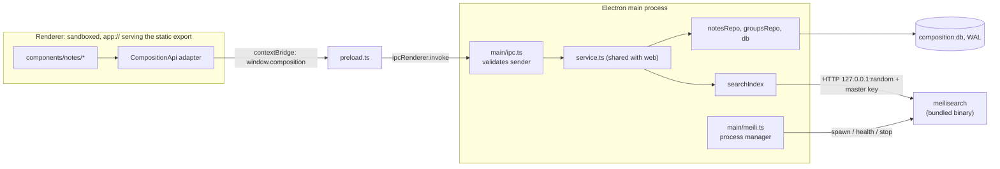

# Desktop app plan

An Electron build of the web app, in `apps/desktop`. Evidence and sources are in
[desktop-app-research.md](desktop-app-research.md); this page is the decisions and the order
of work. Status: **built and verified in development and as an unsigned packaged app
(2026-09-30); signing, notarization and the release workflow are not done** (they need Apple
credentials). See [Build status](#build-status). The four scoping decisions are recorded under
[Confirmed scope](#confirmed-scope); the data-storage split between products is in
[product-builds.md](product-builds.md).

## Goal

A double-clickable, local-first macOS app with the same notes, groups, search and settings as
the web app, reading and writing the same SQLite file as the CLI and web app. No separate
server to start, no Meilisearch to install.

**Non-goals for the first release:** Windows/Linux (later), auto-update (manual downloads
first), sync, MDX/attachments (see [product-positioning.md](product-positioning.md)), Mac App
Store, a universal binary.

## Confirmed scope

| Question | Answer |
|---|---|
| Platforms | macOS only for now; Windows and Linux builds later. |
| Database | All products share `composition.db` for now. The intended later split (desktop + CLI share one; web gets its own) is documented in [product-builds.md](product-builds.md). |
| Meilisearch | v1 bundles it. Licensing is cleared with conditions; see [Licensing Meilisearch](#licensing-meilisearch). |
| Updates | Manual downloads from GitHub Releases. No auto-update in v1. |

## Decisions

| # | Decision | Recommendation | Why | Cost to reverse |
|---|---|---|---|---|
| D1 | How the UI talks to data | **Static export + IPC** | Next's static export can't run Server Actions, but the data layer is already framework-free, so the refactor is moderate. No localhost server, smaller attack surface, no Next runtime shipped. | Medium |
| D2 | Where desktop code lives | **`apps/desktop`**, own `package.json` + lockfile | Matches the "each app keeps its own toolchain" convention. | Low |
| D3 | Sharing code with `apps/web` | Desktop main **bundles `apps/web/src/lib/composition/*`** through one entry file; no root workspace yet | Avoids restructuring lockfiles, CI and Dependabot for a single consumer. | Low (mechanical move to `packages/core` later) |
| D4 | Packager | **electron-builder** | Native modules unpacked automatically, Hardened Runtime on by default, declarative notarize + GitHub publish. Forge is an equally valid first-party alternative. | Low |
| D5 | Native module | **Desktop uses better-sqlite3 13** (N-API); **the web app stays on 12 for now**. Do not merge Dependabot PR #26 until every place the web app runs has Node >= 22.14 | v13 needs Node >= 22.14 (it segfaults on older Node; upstream #1514) though it advertises `>=22`. Electron 44's Node 24.21 is fine, so desktop needs no `@electron/rebuild`. | n/a |
| D6 | Search | **Bundle Meilisearch (community binary), managed by the main process** (confirmed) | It is the product's stated differentiator. SQLite FTS5 is the fallback if size hurts. | Medium |
| D7 | Data location | Default **`~/.composition`** (shared with CLI and web, for now); desktop keeps its **own settings file and its own Meilisearch data dir** (confirmed) | Local-first continuity. The index is derived and rebuilt from SQLite, which is how web/CLI already behave. See [product-builds.md](product-builds.md) for the later split. | Low |
| D8 | First platform | **macOS**, per-arch (arm64, x64) builds (confirmed; Windows and Linux later) | Only platform named in product-positioning. | Low |
| D9 | `/docs` page in desktop | **Omit in v1** | It renders this repo's developer docs from disk; it needs a bundled-docs story and a non-dynamic route to make sense. | Low |

**The fast path, if you want a window on screen quickly:** embed the Next standalone server
(research: Shape B) and skip Phases 2-3. It is faster to a demo and worse to ship (open
localhost port, bigger bundle, Next runtime in the app). I'd only take it as a throwaway
demo, because the seam work in Phase 2 is reusable and the embed glue is not.

## Target architecture

On the web side nothing changes for users: the same `CompositionApi` is backed by Server
Actions that call the same `service.ts`.

## Phases

Sizes are relative (S < M < L), not calendar estimates. Phases 1 and 2 touch different
directories and can run in parallel.

### Phase 0: Prerequisites (S)

**Status: partly done. Meilisearch 1.53.1 is pinned with GitHub's SHA-256 digests; the Next docs were read. Apple Developer enrollment is yours to do and still pending.**

- **Do not merge** Dependabot PR #26 (better-sqlite3 13.0.3) yet: v13 crashes on Node < 22.14
  (found on this machine's 22.13.1; see [the research](desktop-app-research.md#better-sqlite3-in-electron)).
  Upgrade local Node to >= 22.14 first, or close the PR and let Dependabot re-propose later.
  The desktop app is unaffected: it carries its own v13, loaded only by Electron's Node 24.
- **Enroll in the Apple Developer Program ($99/yr)** and create a Developer ID Application
  certificate and an App Store Connect API key. This is an account action only you can do, and
  it gates signed builds, so start it now.
- Choose and record the Meilisearch version to pin (research: 1.53.1 was ~116 MiB, 1.54.2 is
  ~331 MiB). Use the **community** asset, named `meilisearch-<platform>` with no `enterprise`
  in it, downloaded from the official GitHub release; record the version and its SHA-256 in
  `apps/desktop`. See [Licensing Meilisearch](#licensing-meilisearch).
- Install deps in `apps/web` and read `node_modules/next/dist/docs/` before touching Next
  code, as `apps/web/AGENTS.md` requires.

**Exit:** Apple credentials exist; Meilisearch version pinned (done: `apps/desktop/meilisearch.lock.json`).

### Phase 1: Walking skeleton (M, riskiest phase)

**Status: built, except what needs Apple credentials. An unsigned `pnpm package` build passes the full end-to-end smoke test (`pnpm smoke`): ASAR, unpacked N-API better-sqlite3, bundled Meilisearch spawned from Resources, clean shutdown. **Not done:** signing, notarization, the Meilisearch crate license list, and running `pnpm fetch:meilisearch` (downloads about 116 MiB per architecture; the test used Homebrew's identical version as a stand-in).**

Scaffold `apps/desktop` and make a **placeholder app** go all the way to a notarized DMG
before any real UI work, so packaging risk surfaces first.

- `apps/desktop`: `package.json`, `tsconfig`, `electron-builder.yml`, `src/main/index.ts`,
  `src/preload.ts`, a one-page placeholder renderer served over `app://`
  (`protocol.registerSchemesAsPrivileged` + `protocol.handle`).
- On launch, main opens `composition.db` through the shared repos and shows the note count;
  spawns the pinned Meilisearch from `Resources` (port 0/random, key file mode `0600`,
  health-poll, stop on quit) and shows its health.
- electron-builder: `asar` on, Meilisearch via `extraResources`, hardened runtime,
  entitlements, notarize via the `APPLE_API_KEY*` env vars, per-arch DMG + ZIP.
- Licensing files shipped inside the app: Meilisearch's MIT notice, a third-party notices list
  for its bundled dependencies, and the notices Electron ships with. Start Meilisearch with
  `--no-analytics`, as the CLI does.
- Root `package.json`: `test:desktop`, `build:desktop` scripts.

**Exit:** a signed, notarized DMG that installs on a clean Mac, opens the real database,
starts Meilisearch, and leaves no orphaned process after quit. The licence notices are visible
in the installed app. Installed and compressed sizes and idle memory are recorded in the
research doc.

### Phase 2: Transport seam in `apps/web` (M, no Electron)

**Status: done. `api.ts` (contract), `service.ts` (framework-free implementation), `actions.ts` (thin Server Action wrappers), `client.ts` (what components import). 17 new web tests, web build and routes unchanged.**

Behavior-preserving refactor of the web app. Independent of Phase 1.

- Move the logic out of `lib/composition/actions.ts` and `app/settings/actions.ts` into
  `lib/composition/service.ts` (no `next/*` imports): `saveNoteContent`'s frontmatter
  reconciliation, `searchNotes`' never-throws contract, `deleteGroup`'s `GroupNotEmpty` mapping,
  `saveLayout`/theme/data-location saves. Add the read paths the server pages do inline today
  (`listNotes`, `listGroups`, layout, settings view).
- Reduce the two `actions.ts` files to `"use server"` wrappers: `service` call + `revalidatePath`.
- Define `CompositionApi` (the service's surface) and a provider/hook the four call sites use
  (`NotesApp`, `SearchBar`, `useLayout`, `SettingsForm`). The web implementation is the Server
  Actions.
- Parametrize the two hard-coded locations so desktop can own its own: the settings path in
  `webSettings.ts` (`~/.composition-web/settings.json`) and the Meilisearch URL and key in
  `searchIndex.ts` (already env-overridable via `MEILI_URL` / `MEILI_MASTER_KEY`).
- Tests: logic tests move to `service`; `NotesApp.test.tsx` passes a fake `CompositionApi`
  instead of `vi.mock`-ing the actions module.

**Exit:** `pnpm test:web` green; the web app behaves identically; no `next/*` import remains
in `service.ts` or anything it imports.

### Phase 3: Static-exportable renderer (M)

**Status: done. The same components build as a static export with `COMPOSITION_TARGET=desktop`. Mechanism: sibling `*.desktop.*` files, picked by `pageExtensions` (route files) and Turbopack `resolveExtensions` (everything else); see `apps/web/next.config.ts`. The desktop build has `/` and `/settings` only.**

Make `apps/web` able to build with `output: 'export'` when `COMPOSITION_TARGET=desktop`
(web builds unchanged).

- Server pages become thin client components that load through `CompositionApi`:
  `app/page.tsx`, `app/settings/page.tsx`. Remove `force-dynamic` from these.
- `SettingsForm`: replace `useActionState` + server action with an api call in a transition,
  so it works in both targets.
- Theme without a server-rendered `<html>`: the preload exposes a synchronous initial snapshot
  (theme, layout), and an early script sets `data-theme` before first paint, avoiding a flash.
- Omit or hide `/docs` and the "Docs" link in the desktop build (D9).
- Protocol handler maps clean paths (`/settings`) to exported files.

**Exit:** `COMPOSITION_TARGET=desktop next build` succeeds and the output renders in a browser
against a fake `CompositionApi`; `next font` behavior offline is verified.

### Phase 4: Real shell and IPC (M)

**Status: done apart from window-state persistence and a native Settings menu item. Sender-checked, argument-validated IPC; single-instance lock; `pnpm dev` hot-reload loop.**

- `main/ipc.ts`: one `ipcMain.handle` per `CompositionApi` method, generated from a single
  list so the contract can't drift; **reject messages whose sender isn't the `app://` frame**;
  validate argument types (the web actions currently trust TypeScript's types).
- `preload.ts`: `contextBridge` exposing only `window.composition` (never raw `ipcRenderer`).
- Wire `searchIndex` to the managed Meilisearch (index best-effort on write; reindex from
  SQLite on start, as the CLI does).
- Single-instance lock (two instances would fight over one SQLite file and one Meilisearch
  data dir), window-state persistence, native menu, external links via the OS browser.
- Dev loop: `pnpm --dir apps/desktop dev` points the window at `next dev` for hot reload.

**Exit:** notes, groups, search, settings and layout all work in the dev app against the real
`~/.composition` database, including while the CLI is open.

### Phase 5: CI and release (M)

**Status: partly done. Desktop typecheck and unit tests run in `unit-tests.yml`; Dependabot watches `apps/desktop`. **Not done:** the tag-triggered release workflow (needs the signing secrets).**

- Extend `.github/workflows/unit-tests.yml`: install `apps/desktop`, run `test:desktop`,
  update `cache-dependency-path`.
- New workflow on a `desktop-v*` tag, macOS runner: build per-arch, sign, notarize, attach to
  a **draft** GitHub Release. Secrets: `CSC_LINK`/`CSC_KEY_PASSWORD` (Developer ID cert) and
  `APPLE_API_KEY`, `APPLE_API_KEY_ID`, `APPLE_API_ISSUER`.
- Every `uses:` SHA-pinned with a version comment; run `pnpm lint:actions` (repo rule in
  `AGENTS.md`).
- Dependabot: add an `npm` entry for `/apps/desktop`.
- Distribution is **manual download** from the GitHub Release. No auto-update in v1.

**Exit:** pushing a tag produces a draft release with notarized, downloadable DMGs.

### Phase 6: Hardening and polish (S-M)

**Status: partly done. Sandbox, context isolation, a CSP on `app://`, navigation and window-open guards, and a hardened Meilisearch (master key in the environment, production mode, no analytics) are in. **Not done:** fuses, automatic Meilisearch restart (it degrades to a clear message instead), the app icon, and a final app name and bundle identifier.**

Sandbox and context isolation confirmed on; CSP set on `app://` responses; `will-navigate` and
window-open restricted; fuses set at package time; crash/restart handling for Meilisearch;
clear in-app message when search is unavailable (the web UI already shows one); app icon,
name, bundle id.

### Later (L, not scheduled)

Windows (EV or Azure Artifact Signing), Linux, auto-update (`update.electronjs.org` fits:
the repo is public, builds are on GitHub Releases, and macOS builds will already be signed),
universal binary, SQLite FTS5 as a Meilisearch-free fallback, docs viewer, deep links, and the
web/desktop database split described in [product-builds.md](product-builds.md).

## Testing

- `service.ts`: Vitest, same temp-`HOME` pattern as `lib/composition/actions.test.ts`.
- `meili.ts`: against a fake executable (fails to start, never becomes healthy, dies mid-run)
  to cover the error paths the CLI's `MeiliProcessManager` handles.
- IPC contract: a test that every `CompositionApi` method has a handler and that an unknown
  sender is rejected.
- Packaged-app smoke in CI: launch the built app, wait for the DB and Meilisearch health, quit,
  assert no child process remains.

## Risks

| Risk | Mitigation |
|---|---|
| N-API better-sqlite3 fails under packaged, signed Electron | Phase 1 proves it before any refactor |
| Meilisearch bundle is ~330 MiB per arch | Pin a smaller version, measure compressed size in Phase 1, FTS5 fallback (D6) |
| Nested Meilisearch binary fails notarization | Phase 1; `osx-sign` `binaries` option |
| Apple enrollment delay | Phase 0, start immediately |
| Electron majors every 8 weeks, three supported | Budget a quarterly bump; Dependabot covers it once D2 is wired |
| Third writer on the shared SQLite file | WAL already on; idempotent migrations; single-instance lock; schema changes must land in both `storage.py` and `db.ts` ([product-builds.md](product-builds.md)) |
| Shipping the wrong Meilisearch edition | Community asset only, version + checksum recorded; see [Licensing Meilisearch](#licensing-meilisearch) |
| Phase 2 regresses the web app | Behavior-preserving, test-first, merged on its own |

## Licensing Meilisearch

Short version: **bundling the community Meilisearch binary is permitted and needs no special
license**, provided you ship the right binary and carry the notices. This is a reading of the
primary sources in [desktop-app-research.md](desktop-app-research.md#licensing), not legal advice.

1. **Ship the community binary only.** Meilisearch's community edition is MIT, free "for
   anyone, including commercial usage". The enterprise edition is BUSL-1.1 and "not allowed in
   production without a commercial agreement". Releases publish both:
   `meilisearch-<platform>` (community) and `meilisearch-enterprise-<platform>`. Never bundle
   the `enterprise` one.
2. **Keep the MIT notice.** MIT requires its copyright and permission notice to accompany
   copies, so include Meilisearch's `LICENSE-MIT` text in the app.
3. **Carry third-party notices.** Meilisearch is a Rust program built from many crates, each
   under its own license, and permissive licenses typically carry their own attribution
   requirement. I have not audited that list. Generate a notices list from Meilisearch's
   `Cargo.lock` at the pinned tag, read it for anything that is not permissive, and ship it.
4. **Keep telemetry off.** Meilisearch collects anonymized usage data unless started with
   `--no-analytics`. The CLI already passes it; the desktop app must too.
5. **Don't imply endorsement.** No Meilisearch logo or name as part of the app's branding. A
   factual "uses Meilisearch" in the notices is ordinary. I found no published trademark
   policy for the open-source project, so this is the conservative reading.

Separate from Meilisearch: this repo has no `LICENSE` file, so the app's own license is
undefined. MIT does not impose anything on the app that bundles it, but you will want to pick
a license before publishing binaries on GitHub Releases.

## Build status

| Area | State |
|---|---|
| Web app on the new seam | Done; web suite green, `next build` routes unchanged |
| Desktop static renderer | Done; same UI, Tailwind and themes as the web app |
| UI components | Done; shadcn/ui (Radix) on Tailwind v4 in `apps/web`, inherited by the desktop build; see [ui/web-components.md](ui/web-components.md) |
| Electron shell, IPC, protocol, CSP | Done; 83 desktop unit tests |
| Bundled Meilisearch lifecycle | Done (start, health, stop, orphan cleanup, unexpected-exit message) |
| Unsigned packaged app | Verified end to end with `pnpm package && SMOKE_EXECUTABLE=... pnpm smoke` |
| Code signing + notarization | **Blocked on Apple Developer credentials** |
| Release workflow (tag -> draft GitHub Release) | Not started; needs the signing secrets |
| Meilisearch Rust-crate license list | Not generated; release blocker |
| App identifier, name, icon | Provisional: `com.meddlin.composition`, default Electron icon |

## Still open

- **App name and bundle identifier.** `com.meddlin.composition` is a placeholder in
  `apps/desktop/electron-builder.yml`. It becomes part of the code signature and of where macOS
  stores app data, so settle it before the first public build.
- **Apple Developer Program enrollment and a Developer ID certificate** (Phase 0).
- **Meilisearch third-party notices.** Generate the license list for the Rust crates in the
  pinned version's `Cargo.lock` into `apps/desktop/licenses/meilisearch-third-party.txt`;
  `collect-licenses.mjs` warns until it exists.
- **Running `pnpm fetch:meilisearch`** for the real, checksum-verified release binaries
  (about 116 MiB per architecture) before the first packaged release.
